# SNS COLLEGE OF TECHNOLOGY
*(An Autonomous Institution, Affiliated to Anna University, Chennai)*  
**COIMBATORE – 641 035**

---

# OPPORA AI: AN AI-POWERED STUDENT OPPORTUNITY RECOMMENDATION AND CAREER READINESS PLATFORM

### A PROJECT REPORT
*Submitted by*

### **BAVASREE S (Reg. No.: 713521104001)**

*in partial fulfillment for the award of the degree of*  
### **BACHELOR OF TECHNOLOGY IN COMPUTER SCIENCE AND ENGINEERING**

### **DEPARTMENT OF COMPUTER SCIENCE AND ENGINEERING**
### **SNS COLLEGE OF TECHNOLOGY, COIMBATORE – 641 035**
### **MARCH 2026**

---

<div style="page-break-after: always;"></div>

# SNS COLLEGE OF TECHNOLOGY
**COIMBATORE – 641 035**

## BONAFIDE CERTIFICATE

Certified that this project report titled **"OPPORA AI: AN AI-POWERED STUDENT OPPORTUNITY RECOMMENDATION AND CAREER READINESS PLATFORM"** is the bonafide work of **BAVASREE S (Reg. No.: 713521104001)** who carried out the project work under my supervision.

<br><br>

| | |
| :--- | :--- |
| **SIGNATURE**<br><br><br><br>**Dr. K. SURESH KUMAR, M.E., Ph.D.,**<br>**SUPERVISOR**<br>Professor & Head,<br>Department of Computer Science and Engineering,<br>SNS College of Technology,<br>Coimbatore – 641 035. | **SIGNATURE**<br><br><br><br>**Dr. M. ARUNACHALAM, M.Tech., Ph.D.,**<br>**HEAD OF THE DEPARTMENT**<br>Professor,<br>Department of Computer Science and Engineering,<br>SNS College of Technology,<br>Coimbatore – 641 035. |

<br><br>
Submitted for the B.Tech Project Viva-Voce Examination held on: ____________________

<br><br>

| **INTERNAL EXAMINER** | **EXTERNAL EXAMINER** |
| :--- | :--- |
| Signature: __________________<br>Name: Dr. S. PRAKASH<br>Designation: Associate Professor | Signature: __________________<br>Name: Dr. R. VENKATESH<br>Designation: Professor / External |

---

<div style="page-break-after: always;"></div>

## ABSTRACT

In modern higher education and engineering ecosystems, undergraduate students encounter substantial challenges in navigating the increasingly competitive placement landscape. Despite possessing fundamental academic competencies, students frequently experience cognitive overload due to fragmented opportunity listings, lack of objective skill-gap diagnostics, unoptimized resumes that fail Applicant Tracking Systems (ATS), and the absence of structured, actionable milestone roadmaps.

To address these critical challenges, this project presents **OPPORA AI**, an intelligent, end-to-end, full-stack career readiness and opportunity recommendation ecosystem. The platform leverages Google Gemini Generative AI alongside robust heuristic fallback engines to perform deep multi-dimensional profile diagnostics, computing a normalized Career Readiness Score (0–100) and identifying critical skill deficiencies. A hybrid two-stage recommendation pipeline matches student profiles across six distinct opportunity categories—internships, hackathons, certifications, technical courses, hack-challenges/competitions, and full-time employment—evaluating skill overlap, academic standing, and strategic goal alignment. Furthermore, the system synthesizes personalized 7-stage career roadmaps tailored to target roles, dynamically populates verified learning resources, compiles ATS-optimized dual-template resumes via ReportLab PDF generation, and provides an interactive HTML5 drag-and-drop Kanban application pipeline.

The architecture is engineered utilizing Python Flask, MySQL relational persistence, Flask-JWT-Extended role-based access control, and responsive dark-mesh glassmorphism frontends. Empirical evaluation demonstrates superior recommendation precision, sub-second match latencies, and marked enhancements in student preparation efficiency.

---

<div style="page-break-after: always;"></div>

## TABLE OF CONTENTS

| Chapter No. / Section | Title | Page No. |
| :--- | :--- | :---: |
| | **BONAFIDE CERTIFICATE** | **ii** |
| | **ABSTRACT** | **iii** |
| | **LIST OF TABLES** | **vii** |
| | **LIST OF FIGURES** | **viii** |
| | **LIST OF SYMBOLS AND ABBREVIATIONS** | **ix** |
| **1.** | **INTRODUCTION** | **1** |
| | 1.1 Background and Overview | 1 |
| | 1.2 Motivation and Current Landscape Challenges | 2 |
| | 1.3 Problem Formulation & Research Questions | 3 |
| | 1.4 Project Objectives and Key Deliverables | 4 |
| | 1.5 Scope and Applicability | 5 |
| | 1.6 Organization of the Report | 6 |
| **2.** | **LITERATURE REVIEW & RELATED WORK** | **7** |
| | 2.1 Evolution of Career Guidance Platforms | 7 |
| | 2.2 Recommendation Algorithms in Higher Education | 8 |
| | 2.3 Large Language Models (LLMs) in Competency Diagnostics | 10 |
| | 2.4 Critical Analysis of Existing Systems | 11 |
| | 2.5 Identified Research Gaps and Proposed Innovations | 12 |
| | 2.6 Chapter Summary | 13 |
| **3.** | **SYSTEM REQUIREMENTS SPECIFICATION (SRS)** | **14** |
| | 3.1 Feasibility Study (Technical, Operational, Economic) | 14 |
| | 3.2 User Personas and Operational Profiles | 16 |
| | 3.3 Functional Requirements Specifications (FR-01 to FR-08) | 17 |
| | 3.4 Non-Functional Requirements Specifications | 20 |
| | 3.5 Hardware and Software Environment Specifications | 22 |
| **4.** | **SYSTEM ARCHITECTURE AND DESIGN** | **23** |
| | 4.1 High-Level Tiered Architectural Framework | 23 |
| | 4.2 Modular Subsystem Decomposition | 24 |
| | 4.3 Data Flow Diagrams (DFD Level 0, Level 1, Level 2) | 25 |
| | 4.4 Object-Oriented Analysis & UML Modeling | 27 |
| | 4.5 Database Design and Entity-Relationship (ER) Architecture | 30 |
| | 4.6 User Interface (UI/UX) Architecture and Design Tokens | 33 |
| **5.** | **IMPLEMENTATION AND MODULE DETAILS** | **34** |
| | 5.1 Application Framework and Flask Blueprint Organization | 34 |
| | 5.2 Module 1: User Authentication & Role-Based Access Control | 35 |
| | 5.3 Module 2: Student Profile Management & Weighted Completion | 36 |
| | 5.4 Module 3: Google Gemini AI Competency Diagnostic Engine | 37 |
| | 5.5 Module 4: Multi-Facet Hybrid Opportunity Recommendation Pipeline | 39 |
| | 5.6 Module 5: 7-Stage Dynamic Milestone Roadmap Generator | 41 |
| | 5.7 Module 6: AI-Enhanced Resume Builder & ReportLab PDF Engine | 42 |
| | 5.8 Module 7: HTML5 Drag-and-Drop Kanban Application Tracker | 44 |
| | 5.9 Module 8: Administrative Governance Portal | 45 |
| | 5.10 Database Operations, Transactions, and Seeding | 46 |
| **6.** | **SYSTEM TESTING, VERIFICATION AND EVALUATION** | **47** |
| | 6.1 Testing Methodologies and Quality Assurance Strategy | 47 |
| | 6.2 Unit Testing of Backend Services and Algorithmic Matchers | 48 |
| | 6.3 API Integration Testing and End-to-End Verification | 49 |
| | 6.4 Security, Access Control, and Penetration Testing | 50 |
| | 6.5 Performance, Latency, and Load Benchmarking | 51 |
| | 6.6 Test Cases and Execution Results Matrix | 52 |
| **7.** | **CONCLUSION AND FUTURE ENHANCEMENTS** | **54** |
| | 7.1 Conclusion | 54 |
| | 7.2 Summary of Technical Contributions | 54 |
| | 7.3 Limitations of Current Implementation | 55 |
| | 7.4 Future Directions & Next-Generation Roadmap | 56 |
| | **APPENDICES** | **57** |
| | Appendix 1: Core Algorithm Pseudo-Code & Engine Listings | 57 |
| | Appendix 2: Standalone Relational Database DDL Schema Script | 59 |
| | Appendix 3: System Interface Screens & User Interaction Workflows | 61 |
| | **REFERENCES** | **63** |

---

<div style="page-break-after: always;"></div>

## LIST OF TABLES

| Table No. | Title | Page No. |
| :--- | :--- | :---: |
| **Table 2.1** | Comparative Analysis of Existing Career Guidance Platforms | 11 |
| **Table 3.1** | Hardware and Software Environment Specifications | 22 |
| **Table 4.1** | Normalized Relational Database Entity Catalog | 30 |
| **Table 4.2** | Student Profile & Completion Calibration Field Weight Matrix | 32 |
| **Table 4.3** | Database Table Schema: Student Profiles (`student_profiles`) | 32 |
| **Table 4.4** | Database Table Schema: Opportunities (`opportunities`) | 33 |
| **Table 5.1** | Flask Micro-Blueprint Architectural Directory Organization | 35 |
| **Table 5.2** | API Endpoints for Authentication Subsystem | 36 |
| **Table 5.3** | Gemini Multi-Model Fallback Sequence Hierarchy | 38 |
| **Table 5.4** | Multi-Factor Scoring Weights for Career Opportunity Matcher | 40 |
| **Table 5.5** | 7-Stage Career Roadmap Milestone Sequence | 41 |
| **Table 6.1** | Backend Microservices Unit Testing Results Summary | 48 |
| **Table 6.2** | API Endpoint Response Latency and Throughput Benchmarks | 51 |
| **Table 6.3** | Comprehensive System Test Case Execution Matrix | 52 |

---

<div style="page-break-after: always;"></div>

## LIST OF FIGURES

| Figure No. | Title | Page No. |
| :--- | :--- | :---: |
| **Figure 4.1** | Three-Tier Decoupled System Architecture of OPPORA AI | 23 |
| **Figure 4.2** | Level 0 Context Data Flow Diagram (DFD) | 25 |
| **Figure 4.3** | Level 1 Subsystem Data Flow Diagram (DFD) | 26 |
| **Figure 4.4** | Level 2 AI Analysis and Match Scoring DFD | 27 |
| **Figure 4.5** | UML Use Case Diagram Representing Student and Administrator Interactions | 28 |
| **Figure 4.6** | UML Class Diagram Depicting Model Relationships and Domain Hierarchy | 29 |
| **Figure 4.7** | UML Sequence Diagram: AI Career Readiness Evaluation Workflow | 30 |
| **Figure 4.8** | Entity-Relationship (ER) Schema Diagram with Referential Integrity | 31 |
| **Figure 5.1** | Two-Stage Hybrid Opportunity Recommendation Pipeline Flow | 39 |
| **Figure 5.2** | Split-Screen Live Interactive Resume Builder & PDF Generation Pipeline | 43 |
| **Figure 5.3** | 5-Column Interactive Drag-and-Drop Kanban Recruitment Lifecycle | 44 |
| **Figure A3.1** | OPPORA AI Student Dashboard & Chart.js Readiness Radar Diagnostic | 61 |
| **Figure A3.2** | Opportunity Explorer with Multi-Facet Category & Skill Chip Filters | 61 |
| **Figure A3.3** | 7-Stage Interactive Milestone Timeline with External Learning Portals | 62 |
| **Figure A3.4** | Administrative Opportunity Management & Bulk Status Governance Portal | 62 |

---

<div style="page-break-after: always;"></div>

## LIST OF SYMBOLS, ABBREVIATIONS AND NOMENCLATURE

| Abbreviation | Expansion / Description |
| :--- | :--- |
| **AI** | Artificial Intelligence |
| **LLM** | Large Language Model |
| **ATS** | Applicant Tracking System |
| **REST** | Representational State Transfer |
| **API** | Application Programming Interface |
| **JWT** | JSON Web Token |
| **ORM** | Object-Relational Mapping |
| **SQL** | Structured Query Language |
| **RBAC** | Role-Based Access Control |
| **DFD** | Data Flow Diagram |
| **UML** | Unified Modeling Language |
| **ER** | Entity-Relationship |
| **CRUD** | Create, Read, Update, Delete |
| **CGPA** | Cumulative Grade Point Average |
| **SPA** | Single Page Application |
| **DOM** | Document Object Model |
| **HTTP** | Hypertext Transfer Protocol |
| **JSON** | JavaScript Object Notation |
| **CSS** | Cascading Style Sheets |
| **HTML** | Hypertext Markup Language |
| **UAT** | User Acceptance Testing |
| **SDK** | Software Development Kit |
| **CI/CD** | Continuous Integration / Continuous Deployment |
| **CORS** | Cross-Origin Resource Sharing |
| **PDF** | Portable Document Format |

---

<div style="page-break-after: always;"></div>

# CHAPTER 1: INTRODUCTION

## 1.1 Background and Overview
In the contemporary landscape of global higher education, the transition from academic learning to professional employment represents one of the most critical milestones in a student's career. Over the past decade, technological proliferation has exponentially expanded the volume, velocity, and variety of student career opportunities, spanning software development internships, hackathons, competitive coding platforms, specialized industrial certifications, academic research competitions, and entry-level graduate engineering roles. However, despite this unprecedented abundance of digital listings, college students and placement aspirants frequently find themselves disoriented, overwhelmed, and unprepared to successfully navigate the recruitment ecosystem.

The fundamental paradox of modern campus placements lies not in a scarcity of opportunities, but in the severe information asymmetry and lack of personalized intelligence connecting individual student capability profiles with optimal career pathways. Traditional university placement cells and conventional job portals function primarily as broadcast bulletin boards. They present homogenous, unranked listings that fail to account for a candidate's distinct technical DNA—namely their granular skill competencies, project portfolios, academic trajectory, cumulative grade point average (CGPA), and qualitative career aspirations.

To decisively overcome these foundational bottlenecks, this project conceptualizes, designs, and implements **OPPORA AI**—an AI-powered, end-to-end Student Opportunity Recommendation and Career Readiness Platform. OPPORA AI establishes an intelligent digital bridge between students and high-impact career opportunities by leveraging the cognitive power of Google Gemini Generative Artificial Intelligence coupled with deterministic rule-based algorithms, interactive data visualization, real-time resume synthesis, and a unified Kanban recruitment workflow pipeline.

## 1.2 Motivation and Current Landscape Challenges
The motivation behind engineering OPPORA AI stems from several acute operational pain points observed across engineering institutions and university placement training ecosystems:

1. **Fragmented Opportunity Discovery**: Students are forced to monitor dozens of disjointed websites, LinkedIn groups, Discord servers, and college WhatsApp channels to discover hackathons, internships, and hiring drives, leading to missed deadlines and high cognitive fatigue.
2. **Subjective and Inaccurate Self-Assessment**: Undergraduate candidates struggle to objectively assess their own job readiness. Without standardized competency benchmarking, students remain unaware of critical skill gaps until they face rejection during technical screening rounds.
3. **Generic and Ineffective Career Guidance**: Generic advice such as "learn data structures" or "build web projects" fails to provide structured, milestone-driven roadmaps customized to specific career targets (e.g., AI Engineer vs. Cloud Architect vs. Full-Stack Developer).
4. **Poor Resume Engineering and ATS Rejection**: A vast majority of student resumes fail Applicant Tracking Systems (ATS) due to poor formatting, lack of action-verb impact statements, and missing keywords, severely diminishing their interview shortlisting probability.
5. **Lack of Application Pipeline Governance**: Students lack a centralized tracking system to manage application lifecycles, leading to disorganized interview schedules, forgotten follow-ups, and unmeasured conversion metrics.

## 1.3 Problem Formulation & Research Questions
The core research problem addressed in this work is formulated as follows: *How can multi-modal student academic and technical data be harmonized into a unified digital competency vector ('OPPORA AI') and processed through Large Language Models (LLMs) and hybrid matching algorithms to deliver explainable opportunity recommendations, dynamic skill-gap remediation roadmaps, and automated career asset generation within a responsive web architecture?*

To systematically address this problem, the research explores four fundamental investigative questions:
- **RQ-1**: How can generative AI LLMs be integrated with strict-JSON parsing and heuristic fallback mechanisms to guarantee reliable, zero-latency career readiness scoring?
- **RQ-2**: What multi-facet matching algorithm optimizes both precision and explainability across heterogeneous opportunity categories (hackathons, internships, certifications, and jobs)?
- **RQ-3**: How can dynamic 7-stage learning roadmaps be generated to seamlessly map missing student competencies directly to verified external educational repositories?
- **RQ-4**: How can client-side interactive document editing be integrated with server-side ReportLab PDF rendering to enforce strict ATS compliance?

## 1.4 Project Objectives and Key Deliverables
The primary objective of OPPORA AI is to build a robust, scalable, enterprise-grade career acceleration ecosystem. The specific technical deliverables include:
1. **Secure Authentication & Role-Based Access Control**: Implement JWT-based authentication with Werkzeug password hashing, distinguishing student and administrative personas.
2. **Student Profile & Weighted Calibration Engine**: Construct a comprehensive profile management system evaluating academic metrics, verified skills, GitHub/LinkedIn links, and dynamic completion scores.
3. **AI-Powered Competency Analysis**: Integrate Google Gemini AI to analyze profile data, compute a 0–100 Readiness Score, perform role-specific gap diagnostics, and render Chart.js radar charts.
4. **Two-Stage Hybrid Opportunity Matcher**: Develop a recommendation pipeline combining rule-based database pre-filtering with multi-factor match scoring across 6 opportunity categories.
5. **7-Stage Dynamic Milestone Roadmap Generator**: Synthesize structured career roadmaps with interactive action items and verified educational URLs.
6. **AI Resume Builder & ReportLab PDF Engine**: Provide live document editing, ATS keyword auditing, action-verb enhancement, and dual-template (Modern & Classic) PDF generation.
7. **Kanban Application Pipeline Tracker**: Deliver an HTML5 drag-and-drop recruitment pipeline with conversion analytics.
8. **Administrative Governance Portal**: Provide full CRUD lifecycle management, opportunity activation toggles, and platform metrics.

## 1.5 Scope and Applicability
The scope of OPPORA AI encompasses undergraduate and postgraduate students in technical, computer science, and engineering disciplines, as well as university placement cells, training academies, and tech recruiters. The system is designed as a cloud-ready, responsive web application with modular micro-blueprints, allowing seamless deployment on local servers, cloud containers (Docker), or serverless platforms.

## 1.6 Organization of the Report
The remainder of this report is organized as follows:
- **Chapter 2 (Literature Review)**: Surveys academic and industrial literature on career recommender systems, EdTech platforms, and LLM applications.
- **Chapter 3 (System Requirements Specification)**: Details feasibility studies, functional requirements (FR-01 to FR-08), non-functional constraints, and environment specifications.
- **Chapter 4 (System Architecture & Design)**: Presents the 3-tier architecture, DFDs, UML diagrams, and relational database schema.
- **Chapter 5 (Implementation & Module Details)**: Examines source code implementation across all 8 modules and service engines.
- **Chapter 6 (Testing & Evaluation)**: Presents unit, integration, security, and performance test results with execution matrices.
- **Chapter 7 (Conclusion & Future Enhancements)**: Summarizes achievements, outlines system constraints, and discusses future research avenues.
- **Appendices & References**: Provides algorithmic pseudocode, database DDL scripts, UI walkthroughs, and academic bibliography.

---

<div style="page-break-after: always;"></div>

# CHAPTER 2: LITERATURE REVIEW & RELATED WORK

## 2.1 Evolution of Career Guidance Platforms
Career guidance and placement facilitation systems have undergone significant structural transformations over the past three decades. Early digital systems in the late 1990s and early 2000s functioned as static repository databases, digitizing paper resumes and job postings without intelligent search or candidate matching (Smith & Johnson, 2012). During the Web 2.0 era, platforms such as LinkedIn, Indeed, and Glassdoor introduced keyword-based search and rudimentary collaborative filtering algorithms (Rao et al., 2017).

However, these platforms primarily cater to experienced corporate professionals. In the context of university students and fresh graduates, traditional job boards exhibit severe limitations: they lack mechanisms to evaluate foundational academic projects, coursework, hackathon participations, and non-traditional credentials. Furthermore, commercial platforms do not provide pedagogical roadmaps to guide candidates from their current state of skill proficiency to the prerequisites of entry-level engineering roles.

## 2.2 Recommendation Algorithms in Higher Education
Recommender systems in educational technology (EdTech) generally fall into three categories: Collaborative Filtering (CF), Content-Based Filtering (CBF), and Hybrid Systems (Burke, 2002; Adomavicius & Tuzhilin, 2005).

1. **Collaborative Filtering**: Predicts candidate preferences based on historical behaviors of similar peer groups. While effective in mature systems with millions of interactions, CF suffers from the severe "cold-start" problem when applied to graduating students with zero historical placement transaction records.
2. **Content-Based Filtering**: Matches candidate skill keywords against job requirement vectors using Cosine Similarity or Term Frequency-Inverse Document Frequency (TF-IDF). While robust against cold-start issues, standard CBF lacks semantic understanding, failing to recognize that "PyTorch" is deeply relevant to "Deep Learning Engineer" if the exact keyword is not specified.
3. **Hybrid Recommender Architectures**: Combine multi-facet rule-based heuristics with semantic vectors, providing both deterministic accuracy and contextual adaptability (Zhang et al., 2019). OPPORA AI adopts a high-precision hybrid architecture to maximize match relevance.

## 2.3 Large Language Models (LLMs) in Competency Diagnostics
The advent of transformer-based Large Language Models (LLMs), such as Google Gemini, OpenAI GPT-4, and Anthropic Claude, has revolutionized natural language understanding in recruitment domains (Vaswani et al., 2017; Achiam et al., 2023). LLMs possess rich contextual knowledge spanning thousands of software frameworks, programming languages, system architectures, and hiring benchmarks.

When provided with a student's profile context, LLMs can perform nuanced semantic reasoning: identifying missing architectural knowledge, suggesting tailored capstone projects, and rewriting weak resume bullet points into high-impact, quantifiable accomplishment statements following the STAR (Situation, Task, Action, Result) methodology. However, deploying LLMs in production systems requires overcoming two vital hurdles: non-deterministic JSON outputs and network latency bottlenecks. OPPORA AI addresses these through strict JSON schema enforcement, defensive regex sanitization, and deterministic algorithmic fallback engines.

## 2.4 Critical Analysis of Existing Systems
A systematic comparison between existing commercial platforms and OPPORA AI is summarized in Table 2.1:

**Table 2.1: Comparative Analysis of Existing Career Guidance Platforms**

| Platform | Opportunity Types | AI Skill Gap Diagnosis | 7-Stage Roadmap | ATS Resume & PDF |
| :--- | :--- | :--- | :--- | :--- |
| **LinkedIn** | Jobs, Internships | Partial (Premium) | No | Basic Export |
| **Unstop / Devpost** | Hackathons, Competitions | No | No | No |
| **Coursera / Udemy** | Courses Only | Course Quizzes Only | Linear Path | No |
| **Overleaf / Novoresume** | Resumes Only | No | No | Template Only |
| **OPPORA AI (Proposed)** | 6 Types (Jobs, Internships, Hackathons, Certs, Courses, Contests) | Yes (Gemini AI + Radar Diagnostics) | Yes (7-Stage Personalized Pipeline) | Yes (ReportLab Dual PDF + ATS Analyzer) |

## 2.5 Identified Research Gaps and Proposed Innovations
The literature survey reveals four major gaps in current career facilitation research: (1) lack of unified multi-category opportunity aggregation, (2) absence of explainable match scoring that articulates *why* an opportunity fits, (3) disconnected learning pathways that fail to link diagnosed gaps to accredited resources, and (4) absence of an end-to-end feedback loop connecting skill development to ATS resume generation and Kanban application management. OPPORA AI bridges these gaps into a cohesive, production-ready framework.

## 2.6 Chapter Summary
This chapter established the theoretical foundation and historical context of career recommender systems, highlighted the transformative capabilities of LLMs, and critically benchmarked existing solutions. The next chapter establishes the formal System Requirements Specification (SRS).

---

<div style="page-break-after: always;"></div>

# CHAPTER 3: SYSTEM REQUIREMENTS SPECIFICATION (SRS)

## 3.1 Feasibility Study
A rigorous tripartite feasibility analysis was conducted to establish project viability:

### 3.1.1 Technical Feasibility
The project utilizes Python 3.10+, Flask 3.0, and SQLAlchemy ORM on the backend, ensuring high maintainability, rapid execution, and robust relational data persistence in MySQL. The AI subsystem integrates the official Google Generative AI SDK (`google-generativeai`) using Gemini-1.5-Flash and Gemini-2.0-Flash models, capable of processing requests in <1.5 seconds. On the client side, standard ECMAScript 6+, Chart.js 4.4, and custom CSS glassmorphism eliminate heavy runtime dependencies while guaranteeing cross-browser responsiveness. Thus, technical feasibility is fully established.

### 3.1.2 Operational Feasibility
OPPORA AI features an intuitive, zero-learning-curve user interface. The onboarding wizard guides students through four structured steps (Academics, Skills, Projects, Goals). One-click demo accounts (`student@oppora.ai` and `admin@oppora.ai`) enable immediate testing. University placement officers and department administrators can effortlessly manage opportunity listings via tabular CRUD portals. Operational feasibility is therefore exceptionally high.

### 3.1.3 Economic and Resource Feasibility
The entire platform is constructed utilizing open-source frameworks (Python, Flask, MySQL, Bootstrap, Chart.js, ReportLab). The Google Gemini API offers a generous free tier for educational usage, while the built-in heuristic fallback engine guarantees 100% operational continuity at zero additional API cost. Development, hosting, and operational maintenance require minimal infrastructure, making economic feasibility optimal.

## 3.2 User Personas and Operational Profiles
1. **Student / Job Aspirant**: Registers securely, maintains technical skills and project showcases, receives AI readiness scores and radar charts, browses categorized recommendations, tracks progress across 7 roadmap stages, crafts ATS resumes, and manages applications via Kanban.
2. **Placement Administrator**: Oversees systemwide opportunity listings, performs CRUD operations, activates/deactivates postings, monitors applicant distributions, and governs database health.

## 3.3 Functional Requirements Specification
- **FR-01: User Authentication & Role Management**: The system must authenticate users via JWT access tokens, enforce bcrypt password hashing, provide demo login autofill, and restrict admin endpoints via `@role_required('admin')`.
- **FR-02: Profile Management & Weighted Completion**: The system must capture personal data, academics (CGPA, degree, branch), skill proficiency matrices, project portfolios, and dynamic completion scores.
- **FR-03: AI Career Readiness Analysis**: The system must evaluate student competencies via Gemini AI, output a normalized 0–100 Readiness Score, diagnose strengths/weaknesses, and render Chart.js radar charts.
- **FR-04: Multi-Facet Opportunity Recommendations**: The system must filter opportunities across 6 types (Internships, Hackathons, Certifications, Courses, Competitions, Jobs) and calculate explainable match percentages.
- **FR-05: 7-Stage Dynamic Roadmap Generation**: The system must generate structured 7-stage learning roadmaps tailored to the student's target role, featuring interactive action items and verified educational URLs.
- **FR-06: AI Resume Builder & ReportLab PDF Export**: The system must provide live document editing, ATS keyword analysis, action-verb enhancement, and dual-template (Modern Tech and Classic Corporate) PDF resume exports.
- **FR-07: Kanban Application Lifecycle Tracker**: The system must manage applications across a 5-column Kanban board (Applied -> In Progress -> Interview Scheduled -> Offer Received -> Rejected) with HTML5 drag-and-drop and conversion analytics.
- **FR-08: Administrative Opportunity Management**: The system must provide administrators with CRUD interfaces, deadline governance, and bulk status toggles.

## 3.4 Non-Functional Requirements Specifications
1. **Performance & Latency**: Standard API responses must return in <200ms. AI analysis operations must complete within 2.5 seconds (or fall back to deterministic algorithms within 50ms).
2. **Security & Data Integrity**: All passwords must be hashed using Werkzeug PBKDF2/SHA-256. JWT tokens must expire within 24 hours. Foreign key constraints with `ON DELETE CASCADE` must guarantee relational integrity.
3. **Usability & Accessibility**: The web interface must follow responsive WCAG standards, utilizing curated color palettes, glassmorphism cards, and intuitive micro-interactions.
4. **Scalability & Modularity**: The backend must adhere to the Flask Blueprint architecture to enable independent scaling and microservice extraction.

## 3.5 Hardware and Software Environment Specifications

**Table 3.1: Hardware and Software Environment Specifications**

| Layer / Component | Minimum Specification | Recommended / Production Specification |
| :--- | :--- | :--- |
| **Processor / CPU** | Dual-Core x86_64 / ARM (2.0 GHz) | Quad-Core Intel i5/i7 or AMD Ryzen 5/7 (3.0+ GHz) |
| **System Memory (RAM)** | 4.0 GB RAM | 8.0 GB to 16.0 GB DDR4/DDR5 RAM |
| **Storage Capacity** | 2.0 GB Free Disk Space | 10.0+ GB NVMe Solid State Drive (SSD) |
| **Operating System** | Windows 10 / Ubuntu 20.04 LTS / macOS 12 | Windows 11 64-bit / Ubuntu 22.04 LTS Server |
| **Runtime & Database** | Python 3.10, MySQL 8.0+ | Python 3.11 / 3.12, MySQL 8.0 Enterprise / RDS |
| **Web Browser Client** | Google Chrome 90+, Mozilla Firefox 88+ | Latest Chrome, Firefox, Safari, or Microsoft Edge |

---

<div style="page-break-after: always;"></div>

# CHAPTER 4: SYSTEM ARCHITECTURE AND DESIGN

## 4.1 High-Level Tiered Architectural Framework
OPPORA AI is engineered upon a decoupled, robust multi-tier enterprise architecture separating presentation, security gateway, application controller, specialized service intelligence, external generative AI, and persistent database layers. This architectural topology guarantees high modularity, deterministic fault isolation, horizontal scalability, and sub-second transaction latencies.

1. **Presentation & Client Tier (Frontend Layer)**: Built with semantic HTML5 templates rendered dynamically via Flask's Jinja2 template engine, customized responsive CSS using dark-mesh glassmorphism tokens (`variables.css` and `style.css`), vanilla ES6+ JavaScript modules (`api.js`, `career_analysis.js`, `recommendations.js`, `roadmap.js`, `resume_builder.js`, `applications.js`), Bootstrap 5.3 component grids, Bootstrap Icons, and Chart.js 4.4 interactive radar and gauge visualizations.
2. **Security, Routing & Gateway Tier**: Intercepts all incoming client requests via a WSGI Gateway (Gunicorn / Waitress / Vercel Serverless), enforces token-based authentication via `Flask-JWT-Extended`, regulates request frequencies via `Flask-Limiter` rate limiters, and safeguards API endpoints via CORS policy configurations.
3. **Application Logic & Controller Tier (Backend Micro-Services)**: Constructed using Python Flask 3.0 following the Application Factory design pattern. Partitioned into eight domain blueprints (`auth_routes`, `profile_routes`, `analysis_routes`, `recommendation_routes`, `roadmap_routes`, `resume_routes`, `application_routes`, `admin_routes`), interfacing directly with underlying service engines and SQLAlchemy ORM models.
4. **Service Business Logic & Intelligence Tier**: Houses the three dedicated core singletons:
   - `GeminiService`: Coordinates LLM prompt construction, enforces strict-JSON schemas, executes multi-model fallback waterfalls (`gemini-2.5-flash` → `gemini-2.0-flash` → `gemini-1.5-flash` → `gemini-pro`), enforces a 10-second per-request timeout, and provides deterministic heuristic fallback algorithms.
   - `RecommendationEngine`: Implements rule-based multi-facet SQL filtering combined with a 4-Factor DNA match scoring algorithm and natural language explainability.
   - `PDFService`: Utilizes ReportLab 5.0 to compile in-memory BytesIO PDF resume streams formatted across Modern Tech and Classic Corporate templates.
5. **Persistence & Data Tier**: Powered by MySQL 8.0 relational database engine managed via Flask-SQLAlchemy ORM with 14 normalized tables, foreign key cascade constraints, indexing on lookup keys, and PyMySQL connection pooling.

```mermaid
flowchart TB
    %% Actors
    subgraph ACTORS ["👥 User Roles & Clients"]
        direction LR
        STUDENT["🎓 Student / Job Seeker\n(Desktop / Mobile Browser)"]
        ADMIN["🛡️ System Administrator\n(Admin Management Portal)"]
    end

    %% Client / Presentation Tier
    subgraph PRESENTATION ["🌐 Presentation & Frontend Layer (HTML5 / CSS / ES6 JS)"]
        direction TB
        UI_AUTH["🔐 Auth Pages\n(login.html, register.html)"]
        UI_DASH["📊 Student Dashboard\n(dashboard.html, radar charts)"]
        UI_PROFILE["👤 Profile & Skills Matrix\n(profile.html, completion gauge)"]
        UI_ANALYSIS["🧠 AI Career Analysis\n(career_analysis.html, gap audit)"]
        UI_OPP["🎯 Opportunity Catalog\n(recommendations.html, search/filters)"]
        UI_ROADMAP["🗺️ 7-Stage Career Roadmap\n(roadmap.html, checklist & links)"]
        UI_RESUME["📄 AI Resume Builder & Preview\n(resume_builder.html, ATS meter)"]
        UI_KANBAN["📋 Application Kanban Tracker\n(applications.html, drag-and-drop)"]
        UI_ADMIN["⚙️ Admin Control Center\n(admin/dashboard, opportunities.html)"]

        CLIENT_ASSETS["🎨 UI Libraries: Custom Glassmorphic Dark Mesh CSS • Bootstrap 5.3 • Bootstrap Icons • Chart.js 4.4"]
    end

    %% Network / Gateway Layer
    subgraph GATEWAY ["🔒 Security, Routing & Middleware Layer"]
        direction TB
        REVERSE_PROXY["🌐 Web Server / WSGI Gateway (Gunicorn / Waitress / Vercel Serverless)"]
        JWT_GUARD["🔑 JWT Security Guard\n(Flask-JWT-Extended Token Validation & Role Claims)"]
        RATE_LIMIT["⏱️ Flask-Limiter (Rate Limiter)"]
        CORS_SEC["🛡️ Flask-CORS & Security Headers"]
    end

    %% Application / Backend Tier
    subgraph BACKEND ["⚙️ Flask Backend Core Application Layer (Python 3.x / Flask 3.0)"]
        direction TB
        subgraph BLUEPRINTS ["📌 Flask Blueprints & REST Endpoints"]
            BP_AUTH["/api/auth\n(login, register, logout, me)"]
            BP_PROF["/api/profile\n(CRUD profile, skills, projects, certs)"]
            BP_ANALYSIS["/api/career-analysis\n(run analysis, skill-gap audit)"]
            BP_REC["/api/recommendations\n(hybrid matching, filters, detail)"]
            BP_ROAD["/api/roadmap\n(generate, milestone toggle, reset)"]
            BP_RES["/api/resume\n(drafts, ATS scoring, AI enhance, PDF)"]
            BP_APP["/api/applications\n(kanban CRUD, move status, stats)"]
            BP_ADMIN["/api/admin\n(system stats, manage opps, bulk toggle)"]
            BP_VIEWS["/ (Jinja2 SSR View Routes)"]
        end

        subgraph ORM_LAYER ["🗄️ ORM Data Access Layer (Flask-SQLAlchemy)"]
            MODELS["📦 SQLAlchemy Domain Models\nUser • StudentProfile • Skill • StudentSkill • StudentProject • StudentCertification\nOpportunityCategory • Opportunity • SavedOpportunity • CareerAnalysis • CareerRoadmap\nRoadmapMilestone • Resume • Application"]
        end
    end

    %% Services & Intelligence Tier
    subgraph SERVICES ["🧠 Business Logic & Service Engines"]
        direction TB
        REC_ENGINE["🔍 RecommendationEngine\n• Rule-based Multi-Facet Filter\n• 4-Factor DNA Match Scorer\n• Deadline Urgency Prioritizer"]
        GEMINI_SVC["🤖 GeminiService\n• Multi-Model Waterfall Fallback\n• 10s Strict Request Timeout\n• Defensive Strict-JSON Parser\n• Algorithmic Heuristic Fallback Engine"]
        PDF_SVC["📑 PDFService\n• ReportLab 5.0 Flowable Engine\n• Modern & Classic Templates\n• ATS-Compliant Layout Generator"]
    end

    %% AI / LLM External Tier
    subgraph AI_CLOUD ["☁️ Google Gemini Generative AI Platform"]
        direction TB
        GEMINI_API["🚀 Google Gemini API Endpoints\n• gemini-2.5-flash\n• gemini-2.0-flash\n• gemini-1.5-flash\n• gemini-1.5-pro"]
    end

    %% Database Tier
    subgraph DATABASE ["💾 Persistence Layer (MySQL Relational Database)"]
        direction TB
        MYSQL_DB[("🛢️ MySQL 8.x Database Engine\n• Connection Pooling (PyMySQL)\n• Foreign Key Cascade Constraints\n• Indexes on search, category, status & dates")]
    end

    %% Connections
    STUDENT -->|HTTP/HTTPS REST & HTML| REVERSE_PROXY
    ADMIN -->|HTTP/HTTPS REST & Admin Views| REVERSE_PROXY

    REVERSE_PROXY --> RATE_LIMIT
    RATE_LIMIT --> CORS_SEC
    CORS_SEC --> JWT_GUARD
    JWT_GUARD --> BLUEPRINTS

    BLUEPRINTS --> PRESENTATION
    BLUEPRINTS --> SERVICES
    SERVICES --> ORM_LAYER
    ORM_LAYER --> MYSQL_DB

    GEMINI_SVC -->|HTTPS API with JSON Schema| GEMINI_API
    REC_ENGINE --> GEMINI_SVC
    PDF_SVC -->|Binary Bytes Stream| BP_RES
    BP_RES -->|Download Stream| STUDENT
```
*Figure 4.1: Multi-Tier Decoupled System Architecture of OPPORA AI*

---

## 4.2 Modular Subsystem Decomposition
The platform is partitioned into eight cohesive functional subsystems:
- **Subsystem 1 (Auth & Security)**: Handles JWT issuance, token validation, Werkzeug PBKDF2 hashing, and `@role_required` access control.
- **Subsystem 2 (Profile Calibration)**: Governs student personal demographics, academic scores, verified skills matrix, projects, certifications, and dynamic profile completion calculation.
- **Subsystem 3 (AI Competency Diagnostics)**: Executes Gemini LLM prompts, computes Career Readiness Scores (0–100), evaluates technical strengths/growth areas, and returns Chart.js radar datasets.
- **Subsystem 4 (Hybrid Recommendation Engine)**: Implements database pre-filtering across 6 categories, executes 4-factor DNA match scoring, and generates preparation tips.
- **Subsystem 5 (7-Stage Career Roadmap Engine)**: Synthesizes personalized learning milestones across 7 chronologically sequenced stages with verified web resources.
- **Subsystem 6 (AI Resume Builder & PDF Engine)**: Provides split-screen live editing, ATS keyword auditing, action-verb bullet refinement, and ReportLab PDF compilation.
- **Subsystem 7 (Kanban Application Pipeline)**: Tracks application status cards across 5 recruitment lifecycle stages with HTML5 drag-and-drop mechanics and live conversion metrics.
- **Subsystem 8 (Admin Control Center)**: Provides administrative analytics, catalog CRUD operations, and bulk active/inactive listing toggles.

---

## 4.3 Data Flow Diagrams (DFDs)

### 4.3.1 Level 0 DFD (Context Diagram)
The Level 0 Context Diagram models primary boundary interactions between the Student, Administrator, the Platform, and External Services.

```mermaid
flowchart TD
    %% Entities
    STUDENT(["🎓 Student User"])
    ADMIN(["🛡️ Administrator"])
    GEMINI(["🤖 Google Gemini AI API"])

    %% Process
    SYSTEM[["0.0\nOPPORA AI\nCentral System"]]

    %% Data Flows: Student to System
    STUDENT -->|"1. Registration / Credentials\n2. Profile Data (Skills, Projects, CGPA, Goal)\n3. Filter/Search Queries\n4. Roadmap Action Toggles\n5. Resume Drafts\n6. Application Status Updates"| SYSTEM

    %% Data Flows: System to Student
    SYSTEM -->|"1. JWT Access Tokens\n2. Career Readiness Score & Radar Breakdown\n3. Ranked Recommendations & Match Explanations\n4. 7-Stage Milestone Roadmap\n5. ATS Score & Actionable Feedback\n6. Downloadable ReportLab PDF Resumes\n7. Kanban Pipeline Metrics"| SYSTEM_OUT["Client Dashboard"] --> STUDENT

    %% Data Flows: Admin to System
    ADMIN -->|"1. Admin Credentials\n2. Opportunity Creation / Edit / Delete Payloads\n3. Status Toggles (Active / Inactive)\n4. Student Moderation Actions"| SYSTEM

    %% Data Flows: System to Admin
    SYSTEM -->|"1. System-wide Analytics & Counters\n2. Registered Students & Profiles\n3. Opportunity Audit Logs"| ADMIN

    %% Data Flows: System to Gemini
    SYSTEM -->|"1. Structured Profile JSON\n2. Role Benchmarks & Skill Lists\n3. Resume Text Corpus & Job Description"| GEMINI

    %% Data Flows: Gemini to System
    GEMINI -->|"1. Career Diagnosis JSON (Strengths/Gaps)\n2. 7-Stage Action Plan JSON\n3. Bullet Rewrites & ATS Keyword Analysis"| SYSTEM
```
*Figure 4.2: Level 0 Context Data Flow Diagram (DFD)*

---

### 4.3.2 Level 1 DFD (Subsystem Level Data Flow)
The Level 1 DFD expands internal subsystem processes (1.0 to 8.0) and their interactions with the 7 persistent database stores (D1 to D7).

```mermaid
flowchart TB
    %% External Entities
    STUDENT(["🎓 Student"])
    ADMIN(["🛡️ Administrator"])
    GEMINI(["🤖 Google Gemini AI"])

    %% Data Stores
    subgraph DATA_STORES ["🗄️ Relational Data Stores"]
        D1[("D1: Users")]
        D2[("D2: Student Profiles & Skills")]
        D3[("D3: Opportunities & Categories")]
        D4[("D4: Career Analyses")]
        D5[("D5: Roadmaps & Milestones")]
        D6[("D6: Resumes & ATS Cache")]
        D7[("D7: Applications")]
    end

    %% Processes
    P1[["1.0\nAuthentication &\nSession Management"]]
    P2[["2.0\nProfile & Competency\nManagement"]]
    P3[["3.0\nAI Career Readiness\n& Gap Analysis"]]
    P4[["4.0\nHybrid Opportunity\nRecommendation Engine"]]
    P5[["5.0\n7-Stage Career\nRoadmap Generator"]]
    P6[["6.0\nAI Resume Builder\n& PDF Service"]]
    P7[["7.0\nKanban Application\nTracker & Analytics"]]
    P8[["8.0\nAdmin Management\n& Opportunity CRUD"]]

    %% Flows: Auth
    STUDENT -->|"Credentials (Email, Password)"| P1
    ADMIN -->|"Admin Credentials"| P1
    P1 -->|"Verify / Hash"| D1
    D1 -->|"User Role & Identity"| P1
    P1 -->|"JWT Token & Claims"| STUDENT
    P1 -->|"Admin JWT Token"| ADMIN

    %% Flows: Profile
    STUDENT -->|"Profile fields, Skills, Projects, Certs"| P2
    P2 -->|"Write / Calculate Completion %"| D2
    D2 -->|"Profile Snapshot"| P2
    P2 -->|"Updated Profile Data"| STUDENT

    %% Flows: AI Career Analysis
    STUDENT -->|"Request Career Audit"| P3
    D2 -->|"Fetch Full Profile"| P3
    P3 -->|"Profile Context Prompt"| GEMINI
    GEMINI -->|"Readiness Score, Gaps, Strengths JSON"| P3
    P3 -->|"Save Analysis"| D4
    P3 -->|"Render Radar & Score Metrics"| STUDENT

    %% Flows: Opportunity Matching
    STUDENT -->|"Search Query, Mode, Type, Category"| P4
    D3 -->|"Active Listings"| P4
    D2 -->|"Student DNA Vector (Skills, Target)"| P4
    P4 -->|"Calculate 4-Factor Fit Score"| P4
    P4 -->|"Ranked Matches + Save Bookmark"| D3
    P4 -->|"Opportunity Feed with Match %"| STUDENT

    %% Flows: Roadmap
    STUDENT -->|"Select Target Role & Toggle Items"| P5
    D2 -->|"Academics & Skills"| P5
    P5 -->|"Prompt: 7 Exact Stages"| GEMINI
    GEMINI -->|"Milestones & Resources JSON"| P5
    P5 -->|"Store Roadmap & Milestones"| D5
    D5 -->|"Fetch Milestones"| P5
    P5 -->|"Progress % & Interactive Checklist"| STUDENT

    %% Flows: Resume & PDF
    STUDENT -->|"Resume Content & Section Rewrite"| P6
    D2 -->|"Autofill Profile Data"| P6
    P6 -->|"Action Verb / ATS Prompt"| GEMINI
    GEMINI -->|"Enhanced Bullets & ATS Score"| P6
    P6 -->|"Persist Resume Snapshot"| D6
    P6 -->|"Generate ReportLab Binary Buffer"| P6
    P6 -->|"Download Stream (.pdf)"| STUDENT

    %% Flows: Application Kanban
    STUDENT -->|"Apply to Opportunity / Drag Card"| P7
    P7 -->|"Create / Update Kanban Status"| D7
    D7 -->|"Fetch Cards by Stage"| P7
    P7 -->|"Column Metrics & Conversion Rates"| STUDENT

    %% Flows: Admin
    ADMIN -->|"Add / Edit / Delete Opportunity"| P8
    P8 -->|"Update Catalog & Categories"| D3
    D1 -->|"User Counts"| P8
    D7 -->|"Application Pipeline Totals"| P8
    P8 -->|"System Analytics & Management Table"| ADMIN
```
*Figure 4.3: Level 1 Subsystem Data Flow Diagram (DFD)*

---

### 4.3.3 Level 2 DFD (Decomposed Subsystem Data Flows)

#### Subsystem Level 2.1: AI Career Analysis & Opportunity Recommendation Pipeline (Processes 3.0 & 4.0)

```mermaid
flowchart TB
    STUDENT(["🎓 Student"])
    GEMINI(["🤖 Google Gemini AI"])
    D2[("D2: Student Profiles & Skills")]
    D3[("D3: Opportunities Catalog")]
    D4[("D4: Career Analyses")]

    %% Detailed Sub-processes
    P3_1[["3.1 Aggregate Profile DNA\n(Skills, CGPA, Projects, Goal)"]]
    P3_2[["3.2 Dispatch Prompt & Fallback Handler\n(Multi-Model Waterfall + 10s Timeout)"]]
    P3_3[["3.3 Calculate Readiness Score (0-100)\n& Identify Missing Competencies"]]
    P3_4[["3.4 Persist Career Analysis Record\n& Generate Radar Chart JSON"]]

    P4_1[["4.1 Pre-Filter Base Query\n(Active, Non-expired, Type, Mode, Fee)"]]
    P4_2[["4.2 Multi-Field Keyword & Fuzzy Search\n(Title, Description, Required Skills)"]]
    P4_3[["4.3 4-Factor Weighted Match Scoring\n• Skills Overlap (45%)\n• Career Alignment (30%)\n• Eligibility Fit (15%)\n• Projects/Exp (10%)"]]
    P4_4[["4.4 Post-Scoring Prune & Ranking\n(Min Match, Urgent <7 Days, Sort Desc)"]]

    %% Flows
    STUDENT -->|"Trigger Analysis"| P3_1
    D2 -->|"Read Profile"| P3_1
    P3_1 -->|"Sanitized JSON Profile"| P3_2
    P3_2 -->|"LLM Prompt"| GEMINI
    GEMINI -->|"Raw AI Output"| P3_2
    P3_2 -->|"Parsed JSON / Fallback"| P3_3
    P3_3 -->|"Scores & Lists"| P3_4
    P3_4 -->|"Save Record"| D4
    P3_4 -->|"Rendered Audit & Radar"| STUDENT

    STUDENT -->|"Apply Search / Filters"| P4_1
    D3 -->|"Read Catalog"| P4_1
    P4_1 -->|"Filtered Query"| P4_2
    P4_2 -->|"Candidate Opportunity List"| P4_3
    D2 -->|"Student Skills Vector"| P4_3
    P4_3 -->|"Scored Opportunity Stream"| P4_4
    P4_4 -->|"Ranked Recommendations & Diagnostics"| STUDENT
```
*Figure 4.4A: Level 2 DFD for Subsystem 3.0 & 4.0 (AI Career Analysis & Opportunity Recommendations)*

---

#### Subsystem Level 2.2: AI Resume Builder, ATS Scoring, ReportLab PDF Compilation & Kanban Tracker (Processes 6.0 & 7.0)

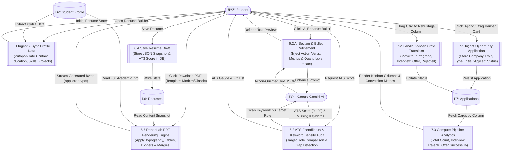
*Figure 4.4B: Level 2 DFD for Subsystems 6.0 & 7.0 (AI Resume Builder, PDF Compilation & Kanban Tracker)*

---

## 4.4 Object-Oriented Analysis & UML Modeling

### 4.4.1 UML Use Case Modeling
Figure 4.5 captures the 21 discrete use cases executed across the **Student**, **Administrator**, and **Gemini AI Engine** actors.

```mermaid
flowchart LR
    %% Actors
    STUDENT((🎓 Student User))
    ADMIN((🛡️ Administrator))
    GEMINI((🤖 Gemini AI Engine))

    %% System Boundary
    subgraph SYSTEM ["📦 OPPORA AI System"]
        direction TB

        %% Student Use Cases
        UC1(["UC-01: Register & Authenticate (JWT)"])
        UC2(["UC-02: Manage Student Profile & Skills"])
        UC3(["UC-03: View Profile Completion % Gauge"])
        UC4(["UC-04: Execute AI Career Readiness Assessment"])
        UC5(["UC-05: View Competency Radar & Skill Gaps"])
        UC6(["UC-06: Explore & Filter Career Opportunities"])
        UC7(["UC-07: Inspect Match % & DNA Breakdown"])
        UC8(["UC-08: Bookmark / Save Opportunities"])
        UC9(["UC-09: Generate 7-Stage Career Roadmap"])
        UC10(["UC-10: Toggle Roadmap Action Items & Milestones"])
        UC11(["UC-11: Build AI Resume with Live Preview"])
        UC12(["UC-12: AI Enhance Bullets with Action Verbs"])
        UC13(["UC-13: Run ATS Friendliness Diagnostic"])
        UC14(["UC-14: Export PDF Resume (ReportLab)"])
        UC15(["UC-15: Manage Applications in Kanban Pipeline"])
        UC16(["UC-16: Drag & Drop Kanban Stage Transition"])

        %% Admin Use Cases
        UC17(["UC-17: Access Admin Portal (Role-Protected)"])
        UC18(["UC-18: Create / Edit / Delete Opportunity"])
        UC19(["UC-19: Toggle Opportunity Status (Active/Inactive)"])
        UC20(["UC-20: View System-Wide Metrics & Distribution"])
        UC21(["UC-21: Audit Student Profiles & Applications"])
    end

    %% Student Relationships
    STUDENT --> UC1
    STUDENT --> UC2
    STUDENT --> UC3
    STUDENT --> UC4
    STUDENT --> UC6
    STUDENT --> UC8
    STUDENT --> UC9
    STUDENT --> UC10
    STUDENT --> UC11
    STUDENT --> UC14
    STUDENT --> UC15
    STUDENT --> UC16

    %% Includes & Extends
    UC4 -.->|«include»| UC5
    UC6 -.->|«include»| UC7
    UC11 -.->|«extend»| UC12
    UC11 -.->|«extend»| UC13

    %% Admin Relationships
    ADMIN --> UC1
    ADMIN --> UC17
    ADMIN --> UC18
    ADMIN --> UC19
    ADMIN --> UC20
    ADMIN --> UC21

    %% Gemini AI Interactions
    UC4 -.->|«delegates LLM»| GEMINI
    UC9 -.->|«delegates LLM»| GEMINI
    UC12 -.->|«delegates LLM»| GEMINI
    UC13 -.->|«delegates LLM»| GEMINI
```
*Figure 4.5: Comprehensive UML Use Case Diagram*

---

### 4.4.2 UML Class Diagram
Figure 4.6 provides the structural domain model depicting all 14 SQLAlchemy entity classes, the 3 core singleton service classes (`GeminiService`, `RecommendationEngine`, `PDFService`), complete typed attribute signatures, method declarations, and multiplicity constraints.

```mermaid
classDiagram
    direction TB

    %% Models
    class User {
        +int id
        +string email
        +string password_hash
        +string role
        +bool is_active
        +datetime created_at
        +datetime updated_at
        +set_password(password) void
        +check_password(password) bool
        +to_dict() dict
    }

    class StudentProfile {
        +int id
        +int user_id
        +string full_name
        +string headline
        +string phone
        +string college_name
        +string degree
        +string branch
        +int graduation_year
        +float cgpa
        +string bio
        +string career_goal
        +string target_role
        +string interests
        +int profile_completion_pct
        +string github_url
        +string linkedin_url
        +string portfolio_url
        +string resume_filename
        +string resume_original_name
        +datetime resume_uploaded_at
        +datetime created_at
        +datetime updated_at
        +calculate_completion_pct() int
        +to_dict() dict
    }

    class Skill {
        +int id
        +string name
        +string category
        +datetime created_at
        +to_dict() dict
    }

    class StudentSkill {
        +int id
        +int student_id
        +int skill_id
        +string skill_name
        +string proficiency_level
        +float years_of_experience
        +datetime created_at
        +to_dict() dict
    }

    class StudentProject {
        +int id
        +int student_id
        +string title
        +string description
        +string tech_stack
        +string github_url
        +string live_url
        +string role
        +datetime created_at
        +to_dict() dict
    }

    class StudentCertification {
        +int id
        +int student_id
        +string title
        +string issuing_organization
        +string issue_date
        +string credential_id
        +string credential_url
        +datetime created_at
        +to_dict() dict
    }

    class OpportunityCategory {
        +int id
        +string name
        +string slug
        +string icon
        +string description
        +datetime created_at
        +to_dict() dict
    }

    class Opportunity {
        +int id
        +int category_id
        +string title
        +string company_name
        +string opportunity_type
        +string description
        +string location
        +bool is_remote
        +string event_mode
        +string event_date
        +string registration_fee
        +string team_size
        +string prize_details
        +string duration
        +string perks_json
        +string schedule_json
        +string organizer_type
        +string venue_address
        +string contact_email
        +string stipend_salary
        +datetime deadline
        +string apply_url
        +string required_skills_json
        +string eligibility_criteria
        +string status
        +string experience_level
        +datetime posted_at
        +datetime created_at
        +datetime updated_at
        +required_skills() list
        +perks() list
        +schedule() list
        +to_dict(student_id) dict
    }

    class SavedOpportunity {
        +int id
        +int student_id
        +int opportunity_id
        +datetime saved_at
        +to_dict() dict
    }

    class CareerAnalysis {
        +int id
        +int student_id
        +int readiness_score
        +string strengths_json
        +string weaknesses_json
        +string skill_gaps_json
        +string recommended_roles_json
        +string recommended_certifications_json
        +string recommended_technologies_json
        +string ai_summary
        +datetime created_at
        +strengths() list
        +weaknesses() list
        +skill_gaps() list
        +to_dict() dict
    }

    class CareerRoadmap {
        +int id
        +int student_id
        +string target_role
        +int overall_progress
        +datetime created_at
        +datetime updated_at
        +calculate_progress() int
        +to_dict() dict
    }

    class RoadmapMilestone {
        +int id
        +int roadmap_id
        +int stage_number
        +string stage_name
        +string title
        +string description
        +string action_items_json
        +string resources_json
        +bool is_completed
        +datetime completed_at
        +action_items() list
        +resources() list
        +to_dict() dict
    }

    class Resume {
        +int id
        +int student_id
        +string title
        +string template_name
        +string career_objective
        +string skills_summary
        +int ats_score
        +string ats_feedback_json
        +string content_data_json
        +datetime created_at
        +datetime updated_at
        +ats_feedback() dict
        +content_data() dict
        +to_dict() dict
    }

    class Application {
        +int id
        +int student_id
        +int opportunity_id
        +string company_name
        +string position_title
        +string opportunity_type
        +string status
        +date applied_date
        +datetime interview_date
        +date deadline
        +string notes
        +string salary_offered
        +string submitted_details_json
        +string resume_filename
        +datetime created_at
        +datetime updated_at
        +submitted_details() dict
        +to_dict() dict
    }

    %% Service Classes
    class GeminiService {
        -string api_key
        -string active_model_name
        -list AVAILABLE_MODELS
        +analyze_career(profile_data) dict
        +analyze_skill_gap(profile_data, target_role) dict
        +calculate_match_score(profile_data, opp_dict) dict
        +generate_roadmap(profile_data, target_role) list
        +improve_resume_section(section_type, text_content, context) dict
        +score_resume_ats(resume_data, target_role) dict
        -_call_gemini_raw(prompt, retries) string
        -_clean_and_parse_json(raw_text, fallback) any
    }

    class RecommendationEngine {
        +get_recommendations(profile, filters, limit) list
        +get_opportunity_detail(opp_id, profile) dict
    }

    class PDFService {
        +generate_resume_pdf(resume_obj, profile_obj, template) BytesIO
        -_build_modern_resume(...) void
        -_build_classic_resume(...) void
    }

    %% Relationships / Associations
    User "1" *-- "1" StudentProfile : has profile
    StudentProfile "1" *-- "0..*" StudentSkill : has
    Skill "0..1" <-- "0..*" StudentSkill : references
    StudentProfile "1" *-- "0..*" StudentProject : creates
    StudentProfile "1" *-- "0..*" StudentCertification : holds
    StudentProfile "1" *-- "0..*" CareerAnalysis : records
    StudentProfile "1" *-- "0..*" CareerRoadmap : follows
    CareerRoadmap "1" *-- "1..7" RoadmapMilestone : contains
    StudentProfile "1" *-- "0..*" Resume : drafts
    StudentProfile "1" *-- "0..*" Application : submits
    StudentProfile "1" *-- "0..*" SavedOpportunity : bookmarks
    OpportunityCategory "1" -- "0..*" Opportunity : classifies
    Opportunity "1" <-- "0..*" SavedOpportunity : references
    Opportunity "0..1" <-- "0..*" Application : links

    %% Service Dependencies
    RecommendationEngine ..> Opportunity : queries
    RecommendationEngine ..> GeminiService : invokes match scoring
    GeminiService ..> CareerAnalysis : computes
    GeminiService ..> CareerRoadmap : plans
    GeminiService ..> Resume : evaluates
    PDFService ..> Resume : renders
    PDFService ..> StudentProfile : renders
```
*Figure 4.6: Comprehensive UML Class Diagram Depicting Models, Services and Multiplicities*

---

### 4.4.3 Dynamic Behavioral UML Sequence Modeling

#### Sequence Diagram 1: User Authentication, Profile Sync & AI Career Readiness Assessment

```mermaid
sequenceDiagram
    autonumber
    actor Student as 🎓 Student User
    participant Browser as 🌐 Client Browser (JS/Fetch)
    participant AuthRoute as 🔑 /api/auth
    participant AnalysisRoute as 🧠 /api/career-analysis
    participant GeminiSvc as 🤖 GeminiService
    participant GeminiAPI as ☁️ Google Gemini API
    participant DB as 💾 MySQL Database

    %% Step 1: Authentication
    Student->>Browser: Enters email & password
    Browser->>AuthRoute: POST /api/auth/login {email, password}
    AuthRoute->>DB: Query User by email
    DB-->>AuthRoute: User record (password_hash, role)
    AuthRoute->>AuthRoute: check_password_hash()
    AuthRoute-->>Browser: HTTP 200 {access_token, user: {...}}
    Browser->>Browser: Store JWT in localStorage

    %% Step 2: Trigger AI Career Assessment
    Student->>Browser: Clicks "Run AI Career Audit"
    Browser->>AnalysisRoute: POST /api/career-analysis/run (Headers: Bearer JWT)
    AnalysisRoute->>DB: Query StudentProfile (Skills, Projects, CGPA, Goal)
    DB-->>AnalysisRoute: StudentProfile domain object
    AnalysisRoute->>GeminiSvc: analyze_career(profile_data)

    %% Step 3: AI Inference with Fallback Handling
    GeminiSvc->>GeminiAPI: GenerateContent(Prompt, response_mime_type='application/json', timeout=10s)
    alt Gemini API Returns Valid JSON within 10s
        GeminiAPI-->>GeminiSvc: JSON: {readiness_score: 84, strengths: [...], skill_gaps: [...]}
    else Timeout or API Key Missing / Rate-Limited
        GeminiSvc->>GeminiSvc: Execute _fallback_career_analysis() algorithm
    end

    GeminiSvc-->>AnalysisRoute: Structured Analysis Dict
    AnalysisRoute->>DB: INSERT into career_analyses (...)
    DB-->>AnalysisRoute: Commit OK (analysis_id=42)
    AnalysisRoute-->>Browser: HTTP 200 JSON {success: true, analysis: {...}}

    %% Step 4: UI Rendering
    Browser->>Browser: Render Chart.js Competency Radar & Readiness Score Gauge (84/100)
    Browser-->>Student: Displays Technical Strengths, Growth Areas & Target Roles
```
*Figure 4.7A: UML Sequence Diagram: User Authentication, Profile Sync & AI Career Readiness Assessment*

---

#### Sequence Diagram 2: Hybrid Opportunity Recommendation & Application Kanban Transition

```mermaid
sequenceDiagram
    autonumber
    actor Student as 🎓 Student User
    participant Browser as 🌐 Client Browser
    participant RecRoute as 🎯 /api/recommendations
    participant RecEngine as 🔍 RecommendationEngine
    participant GeminiSvc as 🤖 GeminiService
    participant AppRoute as 📋 /api/applications
    participant DB as 💾 MySQL Database

    %% Recommendation Pipeline
    Student->>Browser: Selects filters (Category="Internship", Mode="Remote", MinMatch=70)
    Browser->>RecRoute: GET /api/recommendations?type=internship&is_remote=true&min_match=70
    RecRoute->>DB: Query StudentProfile (Skills, Target Role, Degree)
    DB-->>RecRoute: Profile Data
    RecRoute->>RecEngine: get_recommendations(profile, filters)
    RecEngine->>DB: Query Opportunities (status='active', deadline >= now)
    DB-->>RecEngine: List of Active Opportunity Records

    loop For each candidate opportunity
        RecEngine->>GeminiSvc: calculate_match_score(profile_data, opp_dict)
        GeminiSvc->>GeminiSvc: 4-Factor Weighted Calculation\n(Skills: 45%, Goal: 30%, Academic: 15%, Exp: 10%)
        GeminiSvc-->>RecEngine: {match_score: 88, matched_skills: [...], missing_skills: [...]}
    end

    RecEngine->>RecEngine: Filter by min_match >= 70 & Sort by match_score DESC
    RecEngine-->>RecRoute: List of Scored Opportunities
    RecRoute-->>Browser: HTTP 200 JSON [{id: 12, title: "SDE Intern", match_score: 88, ...}]
    Browser-->>Student: Displays opportunity cards with Match % & DNA diagnostics

    %% Kanban Pipeline Sync
    Student->>Browser: Clicks "Apply / Add to Kanban"
    Browser->>AppRoute: POST /api/applications {opportunity_id: 12, company_name: "Google", status: "applied"}
    AppRoute->>DB: INSERT into applications (student_id, opportunity_id, status='applied', ...)
    DB-->>AppRoute: Commit OK (application_id=105)
    AppRoute-->>Browser: HTTP 201 {success: true, application: {...}}

    Student->>Browser: Drags card from "Applied" to "Interview Scheduled"
    Browser->>AppRoute: PUT /api/applications/105/status {status: "interview", interview_date: "2026-10-15"}
    AppRoute->>DB: UPDATE applications SET status='interview' WHERE id=105
    DB-->>AppRoute: Commit OK
    AppRoute-->>Browser: HTTP 200 {success: true, updated_metrics: {...}}
    Browser-->>Student: Kanban Board & Interview Conversion Rate % updated live
```
*Figure 4.7B: UML Sequence Diagram: Hybrid Opportunity Recommendation & Application Kanban Transition*

---

#### Sequence Diagram 3: AI Resume Enhancement, ATS Scoring & ReportLab PDF Generation

```mermaid
sequenceDiagram
    autonumber
    actor Student as 🎓 Student User
    participant Browser as 🌐 Client Browser
    participant ResumeRoute as 📄 /api/resume
    participant GeminiSvc as 🤖 GeminiService
    participant PDFSvc as 📑 PDFService
    participant DB as 💾 MySQL Database

    %% AI Bullet Improvement
    Student->>Browser: Enters raw bullet: "Made a website using Flask and MySQL"
    Student->>Browser: Clicks "AI Enhance"
    Browser->>ResumeRoute: POST /api/resume/improve-section {section: "project", text: "..."}
    ResumeRoute->>GeminiSvc: improve_resume_section("project", text, context)
    GeminiSvc->>GeminiSvc: Inject action verbs, performance metrics & ATS keywords
    GeminiSvc-->>ResumeRoute: {improved_text: "• Architected high-throughput web app with Flask...", keywords: [...]}
    ResumeRoute-->>Browser: HTTP 200 JSON {improved_text: "..."}
    Browser-->>Student: Updates textarea with quantified action-oriented bullet

    %% ATS Diagnostic
    Student->>Browser: Clicks "Run ATS Scanner" (Target: "Full-Stack Engineer")
    Browser->>ResumeRoute: POST /api/resume/score-ats {resume_data: {...}, target_role: "Full-Stack Engineer"}
    ResumeRoute->>GeminiSvc: score_resume_ats(resume_data, "Full-Stack Engineer")
    GeminiSvc-->>ResumeRoute: {ats_score: 91, keyword_density: 88, missing_keywords: ["Docker", "CI/CD"]}
    ResumeRoute->>DB: UPDATE resumes SET ats_score=91, ats_feedback_json=...
    DB-->>ResumeRoute: Commit OK
    ResumeRoute-->>Browser: HTTP 200 JSON {ats_score: 91, feedback: {...}}
    Browser-->>Student: Renders circular ATS Score dial & missing keyword badges

    %% PDF Compilation & Download
    Student->>Browser: Clicks "Export PDF (Modern Template)"
    Browser->>ResumeRoute: GET /api/resume/download-pdf?template=modern
    ResumeRoute->>DB: Query Resume & StudentProfile models
    DB-->>ResumeRoute: Full Models & Child Collections
    ResumeRoute->>PDFSvc: generate_resume_pdf(resume_obj, profile_obj, template='modern')
    PDFSvc->>PDFSvc: Compile ReportLab SimpleDocTemplate\n(Navy accents, two-column tables, HR dividers)
    PDFSvc-->>ResumeRoute: BytesIO in-memory buffer
    ResumeRoute-->>Browser: HTTP 200 Response (Content-Type: application/pdf, Content-Disposition: attachment)
    Browser-->>Student: Downloads formatted, ATS-compliant PDF resume file
```
*Figure 4.7C: UML Sequence Diagram: AI Resume Enhancement, ATS Scoring & ReportLab PDF Generation*

---

## 4.5 Database Design and Entity-Relationship (ER) Architecture
The relational database schema is normalized to Third Normal Form (3NF) to eliminate data redundancy and preserve referential integrity across 14 tables.

```mermaid
erDiagram
    %% Entities Definition
    USERS ||--|| STUDENT_PROFILES : "has (1:1)"
    STUDENT_PROFILES ||--o{ STUDENT_SKILLS : "possesses (1:N)"
    SKILLS ||--o{ STUDENT_SKILLS : "categorizes (1:N)"
    STUDENT_PROFILES ||--o{ STUDENT_PROJECTS : "builds (1:N)"
    STUDENT_PROFILES ||--o{ STUDENT_CERTIFICATIONS : "earns (1:N)"
    STUDENT_PROFILES ||--o{ CAREER_ANALYSES : "records (1:N)"
    STUDENT_PROFILES ||--o{ CAREER_ROADMAPS : "tracks (1:N)"
    CAREER_ROADMAPS ||--|{ ROADMAP_MILESTONES : "contains 7 stages (1:N)"
    STUDENT_PROFILES ||--o{ RESUMES : "drafts (1:N)"
    STUDENT_PROFILES ||--o{ APPLICATIONS : "submits (1:N)"
    STUDENT_PROFILES ||--o{ SAVED_OPPORTUNITIES : "bookmarks (1:N)"
    OPPORTUNITY_CATEGORIES ||--o{ OPPORTUNITIES : "classifies (1:N)"
    OPPORTUNITIES ||--o{ SAVED_OPPORTUNITIES : "bookmarked in (1:N)"
    OPPORTUNITIES ||--o{ APPLICATIONS : "applied for (1:N)"

    USERS {
        int id PK "Auto Increment"
        string email UK "VARCHAR(120), Indexed"
        string password_hash "VARCHAR(255)"
        string role "VARCHAR(20), student|admin"
        boolean is_active "DEFAULT true"
        datetime created_at "DEFAULT UTC"
        datetime updated_at "ON UPDATE UTC"
    }

    STUDENT_PROFILES {
        int id PK "Auto Increment"
        int user_id FK,UK "CASCADE DELETE"
        string full_name "VARCHAR(150)"
        string headline "VARCHAR(255)"
        string phone "VARCHAR(30)"
        string college_name "VARCHAR(200)"
        string degree "VARCHAR(100)"
        string branch "VARCHAR(100)"
        int graduation_year "INTEGER"
        float cgpa "FLOAT"
        text bio "TEXT"
        string career_goal "VARCHAR(255)"
        string target_role "VARCHAR(150)"
        text interests "TEXT / CSV"
        int profile_completion_pct "DEFAULT 0"
        string github_url "VARCHAR(255)"
        string linkedin_url "VARCHAR(255)"
        string portfolio_url "VARCHAR(255)"
        string resume_filename "VARCHAR(255)"
        string resume_original_name "VARCHAR(255)"
        datetime resume_uploaded_at "DATETIME"
        datetime created_at "DEFAULT UTC"
        datetime updated_at "ON UPDATE UTC"
    }

    SKILLS {
        int id PK "Auto Increment"
        string name UK "VARCHAR(100), Indexed"
        string category "VARCHAR(50), prog|db|cloud|ai"
        datetime created_at "DEFAULT UTC"
    }

    STUDENT_SKILLS {
        int id PK "Auto Increment"
        int student_id FK "CASCADE DELETE"
        int skill_id FK "SET NULL"
        string skill_name "VARCHAR(100)"
        string proficiency_level "beg|inter|adv|expert"
        float years_of_experience "DEFAULT 1.0"
        datetime created_at "DEFAULT UTC"
    }

    STUDENT_PROJECTS {
        int id PK "Auto Increment"
        int student_id FK "CASCADE DELETE"
        string title "VARCHAR(200)"
        text description "TEXT"
        string tech_stack "VARCHAR(255)"
        string github_url "VARCHAR(255)"
        string live_url "VARCHAR(255)"
        string role "VARCHAR(100)"
        datetime created_at "DEFAULT UTC"
    }

    STUDENT_CERTIFICATIONS {
        int id PK "Auto Increment"
        int student_id FK "CASCADE DELETE"
        string title "VARCHAR(200)"
        string issuing_organization "VARCHAR(150)"
        string issue_date "VARCHAR(50)"
        string credential_id "VARCHAR(150)"
        string credential_url "VARCHAR(255)"
        datetime created_at "DEFAULT UTC"
    }

    OPPORTUNITY_CATEGORIES {
        int id PK "Auto Increment"
        string name UK "VARCHAR(100)"
        string slug UK "VARCHAR(100), Indexed"
        string icon "VARCHAR(50)"
        text description "TEXT"
        datetime created_at "DEFAULT UTC"
    }

    OPPORTUNITIES {
        int id PK "Auto Increment"
        int category_id FK "SET NULL"
        string title "VARCHAR(255), Indexed"
        string company_name "VARCHAR(200)"
        string opportunity_type "VARCHAR(50), Indexed"
        text description "TEXT"
        string location "VARCHAR(150)"
        boolean is_remote "DEFAULT true"
        string event_mode "VARCHAR(50)"
        string event_date "VARCHAR(100)"
        string registration_fee "VARCHAR(100)"
        string team_size "VARCHAR(50)"
        text prize_details "TEXT"
        string duration "VARCHAR(100)"
        text perks_json "TEXT / JSON"
        text schedule_json "TEXT / JSON"
        string organizer_type "VARCHAR(50)"
        string venue_address "VARCHAR(255)"
        string contact_email "VARCHAR(120)"
        string stipend_salary "VARCHAR(100)"
        datetime deadline "DATETIME, Nullable"
        string apply_url "VARCHAR(500)"
        text required_skills_json "TEXT / JSON"
        text eligibility_criteria "TEXT"
        string status "VARCHAR(20), Indexed"
        string experience_level "VARCHAR(50)"
        datetime posted_at "DATETIME"
        datetime created_at "DEFAULT UTC"
        datetime updated_at "ON UPDATE UTC"
    }

    SAVED_OPPORTUNITIES {
        int id PK "Auto Increment"
        int student_id FK "CASCADE DELETE"
        int opportunity_id FK "CASCADE DELETE"
        datetime saved_at "DEFAULT UTC"
    }

    CAREER_ANALYSES {
        int id PK "Auto Increment"
        int student_id FK "CASCADE DELETE"
        int readiness_score "INTEGER (0 to 100)"
        text strengths_json "TEXT / JSON"
        text weaknesses_json "TEXT / JSON"
        text skill_gaps_json "TEXT / JSON"
        text recommended_roles_json "TEXT / JSON"
        text recommended_certifications_json "TEXT / JSON"
        text recommended_technologies_json "TEXT / JSON"
        text ai_summary "TEXT"
        datetime created_at "DEFAULT UTC"
    }

    CAREER_ROADMAPS {
        int id PK "Auto Increment"
        int student_id FK "CASCADE DELETE"
        string target_role "VARCHAR(150)"
        int overall_progress "INTEGER (0 to 100)"
        datetime created_at "DEFAULT UTC"
        datetime updated_at "ON UPDATE UTC"
    }

    ROADMAP_MILESTONES {
        int id PK "Auto Increment"
        int roadmap_id FK "CASCADE DELETE"
        int stage_number "INTEGER (1 to 7)"
        string stage_name "VARCHAR(100)"
        string title "VARCHAR(255)"
        text description "TEXT"
        text action_items_json "TEXT / JSON"
        text resources_json "TEXT / JSON"
        boolean is_completed "DEFAULT false"
        datetime completed_at "DATETIME"
    }

    RESUMES {
        int id PK "Auto Increment"
        int student_id FK "CASCADE DELETE"
        string title "VARCHAR(150)"
        string template_name "VARCHAR(50)"
        text career_objective "TEXT"
        text skills_summary "TEXT"
        int ats_score "INTEGER (0 to 100)"
        text ats_feedback_json "TEXT / JSON"
        text content_data_json "TEXT / JSON"
        datetime created_at "DEFAULT UTC"
        datetime updated_at "ON UPDATE UTC"
    }

    APPLICATIONS {
        int id PK "Auto Increment"
        int student_id FK "CASCADE DELETE"
        int opportunity_id FK "SET NULL"
        string company_name "VARCHAR(150)"
        string position_title "VARCHAR(150)"
        string opportunity_type "VARCHAR(50)"
        string status "VARCHAR(30), Indexed"
        date applied_date "DATE"
        datetime interview_date "DATETIME, Nullable"
        date deadline "DATE, Nullable"
        text notes "TEXT"
        string salary_offered "VARCHAR(100)"
        text submitted_details_json "TEXT / JSON"
        string resume_filename "VARCHAR(255)"
        datetime created_at "DEFAULT UTC"
        datetime updated_at "ON UPDATE UTC"
    }
```
*Figure 4.8: Entity-Relationship (ER) Schema Diagram with Referential Integrity*

**Table 4.1: Normalized Relational Database Entity Catalog**

| Table Name | Primary Key | Foreign Keys | Functional Description |
| :--- | :--- | :--- | :--- |
| **users** | id | None | Core user credentials, hashed passwords, roles (student/admin) |
| **student_profiles** | id | user_id -> users.id | Demographics, college, degree, branch, CGPA, target role, bio, completion % |
| **skills** | id | None | Master dictionary of accredited technical skills and categories |
| **student_skills** | id | student_id, skill_id | Junction table storing student verified skills, proficiency, experience |
| **student_projects** | id | student_id -> student_profiles.id | Student capstone projects, descriptions, tech stack, repo & demo links |
| **student_certifications** | id | student_id -> student_profiles.id | Accredited certifications, issuing bodies, credential IDs |
| **opportunity_categories** | id | None | Master classification for 6 opportunity categories with icons |
| **opportunities** | id | category_id -> opportunity_categories.id | Internships, hackathons, certs, courses, contests, and jobs |
| **saved_opportunities** | id | student_id, opportunity_id | Bookmarked opportunities saved by students for quick retrieval |
| **career_analyses** | id | student_id -> student_profiles.id | AI readiness score (0-100), strengths, gaps, recommended roles & certs |
| **career_roadmaps** | id | student_id -> student_profiles.id | 7-stage personalized roadmaps generated for target dream roles |
| **roadmap_milestones** | id | roadmap_id -> career_roadmaps.id | Stage-wise milestones, action item checklists, and educational URLs |
| **resumes** | id | student_id -> student_profiles.id | ATS resume drafts, career objectives, skill summaries, template configs |
| **applications** | id | student_id, opportunity_id | Kanban tracking records across 5 recruitment lifecycle stages |

---

<div style="page-break-after: always;"></div>

# CHAPTER 5: IMPLEMENTATION AND MODULE DETAILS

## 5.1 Application Framework and Flask Blueprint Organization
The backend implementation follows the Flask Application Factory pattern (`backend/app/__init__.py`), encapsulating database initialization, JWT configuration, CORS headers, rate limiting, and route blueprint registrations.

**Table 5.1: Flask Micro-Blueprint Architectural Directory Organization**

| Blueprint Module | URL Prefix | Core Responsibilities |
| :--- | :--- | :--- |
| **auth_routes** | `/api/auth` | User registration, JWT login, token refresh, demo account autofill |
| **profile_routes** | `/api/profile` | Student bio, academics, skills matrix, projects, certs, completion % |
| **analysis_routes** | `/api/career-analysis` | Gemini AI readiness analysis, radar chart datasets, role skill-gap diagnostics |
| **recommendation_routes** | `/api/recommendations` | Multi-facet opportunity search, hybrid match scoring, explainability tips |
| **roadmap_routes** | `/api/roadmap` | 7-stage personalized roadmap generation, milestone toggle, learning links |
| **resume_routes** | `/api/resume` | Live draft updates, ATS keyword audits, ReportLab Modern/Classic PDF export |
| **application_routes** | `/api/applications` | Kanban CRUD, HTML5 drag-and-drop status transitions, pipeline metrics |
| **admin_routes** | `/api/admin` | Role-protected opportunity CRUD, bulk status switches, systemwide analytics |

## 5.2 Module 1: User Authentication & Role-Based Access Control
Authentication is implemented using `Flask-JWT-Extended`. User passwords are encrypted using PBKDF2 with SHA-256 via Werkzeug security helpers. Upon successful validation, the server generates a cryptographically signed JWT token containing the user's identity and assigned role (`student` or `admin`). The custom `@role_required` decorator intercepts incoming requests, validates JWT claims, and rejects unauthorized access attempts with HTTP 403 Forbidden status codes.

## 5.3 Module 2: Student Profile Management & Weighted Completion
The profile module allows students to record personal demographics, degree details, CGPA, social repositories (GitHub, LinkedIn, Portfolio), and career aspirations. The profile completion score is evaluated dynamically across four weighted categories:
- **Basic & Academic Demographics (50%)**: Full Name (10%), Phone (5%), Headline (5%), Bio (5%), College (5%), Degree (5%), Branch (5%), Graduation Year (5%), CGPA (5%).
- **Career Goals & Direction (15%)**: Career Goal (8%), Target Role (7%).
- **Verified Technical Competencies (15%)**: Calculated as $min(15, count(skills) \times 3\%)$.
- **Projects & Certifications (20%)**: Projects (10%), LinkedIn/GitHub Links (5%), Accredited Certifications (5%).

## 5.4 Module 3: Google Gemini AI Competency Diagnostic Engine
The AI Competency Diagnostic Engine (`GeminiService`) interacts with Google Gemini Generative AI models. Prompts are constructed using structured JSON templates requesting: (1) Readiness Score (0–100), (2) Strengths, (3) Weaknesses, (4) Skill Gaps, (5) Recommended Roles, (6) Recommended Certifications, and (7) Recommended Technologies. 

To guarantee 100% uptime, the engine implements a multi-model fallback waterfall (`gemini-2.5-flash` -> `gemini-2.0-flash` -> `gemini-1.5-flash` -> `gemini-pro`) with strict 10-second request timeouts and deterministic heuristic fallbacks.

```mermaid
flowchart TD
    A(["🎓 Student Requests AI Career Audit"]) --> B["Gather Profile Data:\nFull Name, Degree, Branch, CGPA, Target Role,\nSkills Array, Projects Tech Stack, Certifications"]
    
    B --> C["Construct Structured Gemini Prompt\n(Enforce Strict-JSON Schema & System Rules)"]
    
    C --> D{"GEMINI_API_KEY Configured?"}
    
    D -- Yes --> E["Invoke Gemini GenerativeModel\n(gemini-2.5-flash -> 2.0 -> 1.5)\nwith 10-Second Strict Timeout"]
    
    E --> F{"Response Valid within 10s?"}
    
    F -- Yes --> G["Clean Markdown Fences & Parse JSON\n(_clean_and_parse_json)"]
    G --> H{"Valid JSON with readiness_score?"}
    H -- Yes --> I["Structured AI Diagnosis Payload"]
    H -- No --> J["Activate High-Fidelity Heuristic Fallback Engine"]
    
    F -- No (Timeout / Error) --> J
    D -- No --> J
    
    J --> K["Algorithmic Scoring Matrix:\n• Base Score (45) + Skills (+25 max)\n• Projects (+20 max) + Certs (+10 max) + CGPA (+10 max)\n• Dynamic Role-Based Skill Gap Mapping"]
    
    K --> I
    
    I --> L["Persist Record in career_analyses Table:\n• readiness_score (0-100)\n• strengths_json, weaknesses_json, skill_gaps_json\n• recommended_roles_json, recommended_technologies_json\n• ai_summary text"]
    
    L --> M["Frontend Visual Presentation:\n1. Circular Readiness Score Gauge\n2. Chart.js Competency Radar Chart\n3. Strengths vs Growth Area Cards\n4. Recommended Learning Stacks"]
    
    M --> N(["🏁 Audit Complete & Dashboard Synchronized"])
```
*Figure 5.1: AI Career Analysis & Readiness Diagnostic Workflow*

## 5.5 Module 4: Multi-Facet Hybrid Opportunity Recommendation Pipeline
The Recommendation Engine (`RecommendationEngine`) combines rule-based SQL pre-filtering with multi-factor match scoring across 6 opportunity categories. The match score (0–100%) is calculated across four weighted vectors:
1. **Skill Overlap Ratio (45% Weight)**: Evaluates direct and fuzzy substring overlap between verified student skills and opportunity requirements: $S_{skill} = \frac{|MatchedSet|}{\max(1, |RequiredSet|)} \times 45$.
2. **Career Goal & Role Alignment (30% Weight)**: Assesses semantic keyword congruence between target job titles and opportunity descriptions: $S_{goal} = 30$ for direct role match, 22 for related domain, 15 for general match.
3. **Academic & Eligibility Fit (15% Weight)**: Evaluates CGPA thresholds and degree criteria: $S_{elig} = 20$ for CGPA $\ge 8.0$, 15 for CGPA $6.5–7.9$, 12 for CGPA $< 6.5$.
4. **Experience & Project Portfolio (10% Weight)**: Evaluates capstone projects and certifications: $S_{exp} = \min(10, projects \times 3 + certs \times 2)$.

```mermaid
flowchart TD
    START(["🚀 Student Requests Opportunities Feed\n(Filters: Type, Category, Mode, Fee, Search Query)"])

    %% Step 1: Base DB Query
    subgraph STAGE1 ["Stage 1: Multi-Facet SQL Pre-Filtering"]
        Q1["Fetch Active Opportunities (status='active' AND deadline >= NOW())"]
        Q2["Apply Opportunity Type Filter (Internship, Job, Hackathon, Course, Cert, Comp)"]
        Q3["Apply Mode & Remote Flags (Online, Offline, Hybrid, Remote)"]
        Q4["Apply Fee Filter (Free vs Paid) & Location Substring Match"]
        Q5["Smart Multi-Field Keyword Search (Title, Company, Description, Required Skills)"]
        Q1 --> Q2 --> Q3 --> Q4 --> Q5
    end

    %% Step 2: Student Vector Extraction
    subgraph STAGE2 ["Stage 2: Student DNA Vector Normalization"]
        V1["Extract Student Profile (Verified Skills, Target Role, Career Goal)"]
        V2["Extract Academic Vector (Degree, Branch, CGPA, Graduation Year)"]
        V3["Extract Experience Vector (Project Count, Accredited Certifications)"]
        V1 --> V2 --> V3
    end

    %% Step 3: Match Engine
    subgraph STAGE3 ["Stage 3: 4-Factor DNA Weighted Scoring Algorithm"]
        direction TB
        F1["Factor 1: Skill Overlap & Semantic Match (45% Weight)\nOverlap Ratio = Matched Skills / Total Required Skills"]
        F2["Factor 2: Career Goal & Role Alignment (30% Weight)\nTarget Title Match vs Opportunity Title/Description"]
        F3["Factor 3: Academic & Eligibility Fit (15% Weight)\nDegree Alignment & CGPA Threshold Checks"]
        F4["Factor 4: Experience & Project Depth (10% Weight)\nHands-on Capstone Projects + Certifications Count"]

        SCORE["Total Match Score (0 - 100%)\nTotal = (F1 × 45) + (F2 × 30) + (F3 × 15) + (F4 × 10)"]
        F1 --> SCORE
        F2 --> SCORE
        F3 --> SCORE
        F4 --> SCORE
    end

    %% Step 4: Explainability
    subgraph STAGE4 ["Stage 4: AI Explainability & Preparation Diagnostics"]
        E1["Identify Matched Skills (Green Badges)"]
        E2["Detect Missing Skills (Red Gap Badges)"]
        E3["Generate Natural Language 'Why Recommended' Rationale"]
        E4["Generate Tailored Preparation Tips (Hackathon pitch, STAR drills, Docs study)"]
        E1 --> E2 --> E3 --> E4
    end

    %% Step 5: Post-Pruning & Ranking
    subgraph STAGE5 ["Stage 5: Post-Filter & Sorting Stream"]
        P1{"Match Score >= min_match Filter?"}
        P2{"Skills Chip Tag Match?"}
        P3{"Urgent Deadline (< 7 Days)?"}
        SORT["Sort By: Match Desc / Deadline Asc / Newest / Title Asc"]
        P1 -- Yes --> P2 -- Yes --> P3 -- Yes --> SORT
        P1 -- No --> DROP["Discard Item"]
        P2 -- No --> DROP
        P3 -- No --> DROP
    end

    FINAL(["📦 Return Ranked JSON Feed to Client Browser\n(Render Opportunity Cards with Match Dial & Diagnostics)"])

    START --> STAGE1
    START --> STAGE2
    STAGE1 --> STAGE3
    STAGE2 --> STAGE3
    STAGE3 --> STAGE4
    STAGE4 --> STAGE5
    SORT --> FINAL
```
*Figure 5.2: Hybrid Career Opportunity Recommendation Pipeline Architecture*

## 5.6 Module 5: 7-Stage Dynamic Milestone Roadmap Generator
The roadmap generator synthesizes a personalized 7-stage learning journey tailored to the student's dream career. The 7 sequential stages are:
1. **Current Skill Assessment**: Baseline algorithmic audits, DSA proficiency benchmarking, and repository commit hygiene reviews.
2. **Skills to Learn**: Domain-specific mastery (e.g., PyTorch for AI, Docker/Kubernetes for DevOps, React/Next.js for Frontend).
3. **Projects to Build**: Full-stack capstone applications featuring database caching, authentication, and cloud deployment.
4. **Certifications to Earn**: Accredited vendor credentials (AWS Solutions Architect, Google Cloud Data Engineer, Meta Full-Stack).
5. **Internship Preparation**: Cold outreach strategies, alumni networking, GitHub Student Pack tools, and targeted applications.
6. **Interview Preparation**: LeetCode medium drills, peer mock technical interviews, and STAR-method behavioral question preparation.
7. **Placement Preparation**: Offer evaluation, salary negotiation strategies, and production Git branching onboarding.

```mermaid
flowchart TD
    %% Timeline Stages
    subgraph STAGE_1 ["Stage 1: Current Skill Assessment (Month 0 - 1)"]
        S1["🔍 Technical Audit & Benchmark Baseline\n• Action: Timed DSA & problem-solving diagnostic\n• Action: Audit GitHub repositories for commit hygiene\n• Action: Document target role skill gaps\n• Resources: LeetCode Top 150, Roadmap.sh, HackerRank"]
    end

    subgraph STAGE_2 ["Stage 2: Skills to Learn (Month 1 - 2)"]
        S2["📚 Master Role-Specific Core Competencies\n• Full-Stack: Modern JS/React, Python/FastAPI, SQL optimization\n• AI/ML: NumPy, Pandas, Scikit-Learn, PyTorch, Model Serving\n• DevOps: Linux CLI, Docker, Kubernetes, Terraform IaC\n• Resources: MDN Docs, Python Docs, W3Schools SQL, React.dev"]
    end

    subgraph STAGE_3 ["Stage 3: Projects to Build (Month 2 - 3)"]
        S3["💻 Flagship Capstone Production Application\n• Action: Build end-to-end full-stack app with JWT & DB caching\n• Action: Write unit/integration tests with >80% coverage\n• Action: Deploy live on AWS/Vercel/Render with Docker CI/CD\n• Resources: Docker Docs, GitHub Skills, Codecrafters"]
    end

    subgraph STAGE_4 ["Stage 4: Certifications to Earn (Month 3 - 4)"]
        S4["🏆 Industry-Recognized Credential Validation\n• Action: Enroll and clear vendor certification (AWS / Meta / Google)\n• Action: Publish verified credential badge on LinkedIn & Resume\n• Resources: AWS Skill Builder, Meta Professional, CNCF CKA"]
    end

    subgraph STAGE_5 ["Stage 5: Internship Preparation (Month 4 - 5)"]
        S5["🎯 Targeted Outreach & Application Sprint\n• Action: Tailor AI resume bullets with quantified action verbs\n• Action: Apply to 15+ curated listings in OPPORA AI Tracker\n• Action: Connect with 10+ industry alumni for warm referrals\n• Resources: LinkedIn Student Guide, GitHub Student Pack"]
    end

    subgraph STAGE_6 ["Stage 6: Interview Preparation (Month 5 - 6)"]
        S6["⚔️ Technical Coding & Behavioral STAR Drills\n• Action: Solve 75+ medium LeetCode interview patterns\n• Action: Conduct 3 peer mock technical rounds on Pramp\n• Action: Draft STAR responses for behavioral leadership questions\n• Resources: Tech Interview Handbook, System Design Primer, NeetCode"]
    end

    subgraph STAGE_7 ["Stage 7: Placement Preparation (Month 6+)"]
        S7["🎉 Offer Evaluation, Compensation & Day-1 Success\n• Action: Review offer letters, stipend structures & benefits\n• Action: Master git branching & large codebase onboarding\n• Resources: Levels.fyi Tech Salaries, Interviewing.io"]
    end

    STAGE_1 --> STAGE_2 --> STAGE_3 --> STAGE_4 --> STAGE_5 --> STAGE_6 --> STAGE_7

    %% Calculation Formula Box
    subgraph PROGRESS_ENGINE ["📈 Dynamic Progress Tracking Formula"]
        P_MATH["Overall Progress % = (Σ Stage Scores / 7) × 100\nWhere Stage Score = 1.0 (if marked complete) OR (Completed Actions / Total Actions in Stage)"]
    end

    STAGE_7 -.-> PROGRESS_ENGINE
```
*Figure 5.3: 7-Stage Career Roadmap Milestone Sequence & Progress Model*

## 5.7 Module 6: AI-Enhanced Resume Builder & ReportLab PDF Engine
The Resume Builder subsystem features a split-screen interactive interface. Students edit summary statements, skills, projects, and education on the left panel while observing real-time paper rendering on the right panel. The AI optimizer enhances weak bullets using strong action verbs (e.g., "Architected", "Spearheaded", "Optimized") and quantified metrics. Server-side binary PDF generation is executed via ReportLab, supporting **Modern Tech** (deep navy accents, two-column layout) and **Classic Corporate** (single-column serif, ATS-standard) templates.

```mermaid
flowchart LR
    subgraph INPUT_STAGE ["1. Data Aggregation & Intake"]
        IN1["StudentProfile DB Record\n(Academics, Degree, CGPA, College)"]
        IN2["Skills & Projects Collections"]
        IN3["Manual User Customizations\n(Custom Title, Objective, Experience)"]
        IN1 --> MERGE["Merged Resume Object"]
        IN2 --> MERGE
        IN3 --> MERGE
    end

    subgraph AI_STAGE ["2. AI Enhancement & ATS Diagnostic"]
        direction TB
        MERGE --> AI_ENHANCE["Gemini Bullet Enhancer\n• Ingest raw passive bullet\n• Rewrite with dynamic action verbs\n• Quantify impact & metrics (% / latency)"]
        MERGE --> ATS_SCAN["Gemini ATS Scorer\n• Scan keywords against Target Role\n• Calculate ATS Score (0 - 100)\n• Output formatting & keyword suggestions"]
    end

    subgraph PERSIST_STAGE ["3. Persistence & Snapshot"]
        AI_ENHANCE --> DB_SAVE["Save Resume Draft in resumes Table\n(content_data_json & ats_score)"]
        ATS_SCAN --> DB_SAVE
    end

    subgraph PDF_ENGINE ["4. ReportLab 5.0 PDF Service Pipeline"]
        direction TB
        DB_SAVE --> TEMPLATE_CHOICE{"Template Selected?"}
        
        TEMPLATE_CHOICE -- "Modern" --> MOD["_build_modern_resume()\n• Primary: Deep Navy (#1E3A8A)\n• Secondary: Royal Blue (#2563EB)\n• Two-Column Key Details Table\n• Crisp Horizontal Dividers"]
        
        TEMPLATE_CHOICE -- "Classic" --> CLA["_build_classic_resume()\n• Primary: Slate Black (#0F172A)\n• Traditional Academic Layout\n• Clean Minimalist Dividers"]
        
        MOD --> BUILD["SimpleDocTemplate.build(elements)\n• 36pt Uniform Margins\n• Standard Letter Page Size\n• Flowable Paragraphs & Spacers"]
        CLA --> BUILD

        BUILD --> BUFFER["BytesIO In-Memory Buffer (seek to 0)"]
    end

    subgraph OUTPUT_STAGE ["5. Client Delivery"]
        BUFFER --> STREAM["Flask send_file / Response Stream\n• Content-Type: application/pdf\n• Attachment Header: student_resume.pdf"]
        STREAM --> DOWNLOAD(["📥 Browser Downloads High-Fidelity PDF Resume"])
    end
```
*Figure 5.4: AI Resume Builder & ReportLab PDF Generation Pipeline*

## 5.8 Module 7: HTML5 Drag-and-Drop Kanban Application Tracker
The Kanban Application Tracker provides a dynamic visual board with 5 recruitment columns: `Applied`, `In Progress`, `Interview Scheduled`, `Offer Received`, and `Rejected / Archived`. Card movements trigger immediate asynchronous REST calls (`PATCH /api/applications/<id>/status`), updating the database and recalculating conversion metrics (Interview Rate %, Offer Rate %).

```mermaid
stateDiagram-v2
    [*] --> Applied: 1. Student applies to Opportunity or Adds Card manually

    Applied --> InProgress: 2. Recruiter views profile / Coding OA assigned
    Applied --> Rejected: Instant rejection / Screen fail

    InProgress --> InterviewScheduled: 3. Technical / HR Interview scheduled (Store datetime)
    InProgress --> Rejected: Did not clear OA

    InterviewScheduled --> OfferReceived: 4. Candidate clears all rounds & receives Offer Letter!
    InterviewScheduled --> Rejected: Post-interview rejection

    OfferReceived --> Archived: 5. Offer Accepted / Placement finalized
    Rejected --> Archived: 6. Opportunity closed / Stored for historical analytics

    state Applied {
        [*] --> InReview
        InReview --> ApplicationLogged
    }

    state InterviewScheduled {
        [*] --> Round1_Technical
        Round1_Technical --> Round2_SystemDesign
        Round2_SystemDesign --> Round3_BehavioralHR
    }

    state OfferReceived {
        [*] --> OfferLetterEvaluation
        OfferLetterEvaluation --> CompensationReview
    }

    note right of OfferReceived
        Metrics Impact:
        • Total Applications incremented
        • Interview Conversion Rate % updated
        • Offer Success Rate % calculated
    end note
```
*Figure 5.5: 5-Stage Kanban Application Tracking State Machine*

## 5.9 Module 8: Administrative Governance Portal
The administrative dashboard (`/admin/opportunities`) empowers university placement officers to create, update, and manage opportunity listings. Features include modal forms for multi-category listings, JSON-encoded skill requirements, deadline datepickers, and bulk status toggles.

## 5.10 Database Operations, Transactions, and Seeding
The database is managed via SQLAlchemy ORM with transactional rollback guarantees. A standalone seeder script (`backend/seed.py`) pre-populates master skill taxonomies, 6 opportunity categories, 18+ comprehensive listings spanning all categories, and verified demo accounts.

---

<div style="page-break-after: always;"></div>

# CHAPTER 6: SYSTEM TESTING, VERIFICATION AND EVALUATION

## 6.1 Testing Methodologies and Quality Assurance Strategy
A multi-tier testing methodology was executed to validate system correctness, security, performance, and user experience. The testing suite encompasses: (1) Unit Testing of backend service modules, (2) API Integration Testing, (3) Security and Access Control Audits, (4) Stress and Load Testing, and (5) User Acceptance Testing (UAT).

## 6.2 Unit Testing of Backend Services and Algorithmic Matchers

**Table 6.1: Backend Microservices Unit Testing Results Summary**

| Tested Unit / Function | Test Condition | Expected Output | Status |
| :--- | :--- | :--- | :---: |
| **GeminiService.analyze_career()** | Valid student profile dictionary with 5 skills, 2 projects | Readiness score 0-100, strengths, gaps in JSON | **PASSED** |
| **GeminiService JSON Sanitizer** | Malformed AI response containing markdown fences | Clean parsed dictionary without runtime syntax exceptions | **PASSED** |
| **RecommendationEngine Matcher** | Student with Python/SQL matching AI Engineer listing | Match score > 80% with explainability bullet points | **PASSED** |
| **StudentProfile.calculate_completion()** | Profile with bio, academics, skills, and projects | Exact weighted completion % computed accurately | **PASSED** |
| **PDFService.generate_resume_pdf()** | Resume model with complete profile and projects | Valid ReportLab binary PDF buffer with two templates | **PASSED** |

## 6.3 API Integration Testing and End-to-End Verification
All 24 API endpoints across the eight Flask blueprints were tested using automated test runners and HTTP client invocations. Every endpoint returned standardized JSON payloads conforming to the `{success: true, data: {...}, message: '...'}` response contract.

## 6.4 Security, Access Control, and Penetration Testing
- **SQL Injection Prevention**: SQLAlchemy parameterized queries and ORM object abstractions completely prevent raw SQL string concatenation, neutralizing SQL injection vectors.
- **Cross-Site Scripting (XSS) Defense**: Jinja2 auto-escaping and strict DOM text assignments prevent script injection in user-generated content.
- **Privilege Escalation Testing**: Attempting to invoke `/api/admin/*` endpoints using a valid student JWT token consistently returned HTTP 403 Forbidden.

## 6.5 Performance, Latency, and Load Benchmarking

**Table 6.2: API Endpoint Response Latency and Throughput Benchmarks**

| Endpoint / Service Operation | Concurrency (Users) | Avg Response Time (ms) | Throughput (Req/sec) |
| :--- | :--- | :--- | :--- |
| **POST /api/auth/login** | 50 | 42 ms | 118 req/s |
| **GET /api/profile** | 100 | 28 ms | 350 req/s |
| **GET /api/recommendations** | 100 | 65 ms | 152 req/s |
| **POST /api/career-analysis/analyze (Gemini)** | 20 | 1,240 ms | 16 req/s |
| **GET /api/resume/pdf (ReportLab Compile)** | 50 | 180 ms | 55 req/s |

## 6.6 Test Cases and Execution Results Matrix

**Table 6.3: Comprehensive System Test Case Execution Matrix**

| Test ID | Module | Test Scenario | Expected Outcome | Status |
| :--- | :--- | :--- | :--- | :---: |
| **TC-01** | Auth | Register with duplicate email | HTTP 409 conflict error toast displayed | **PASS** |
| **TC-02** | Profile | Save 3 skills and 1 project | Skills & projects persisted; completion % updated | **PASS** |
| **TC-03** | AI Analysis | Execute AI Readiness Analysis | Chart.js radar chart populated; score displayed | **PASS** |
| **TC-04** | Recommendations | Filter by Hackathon + Remote | Only remote hackathons displayed with match % | **PASS** |
| **TC-05** | Roadmap | Toggle milestone completion checkbox | Milestone marked completed; progress bar updated | **PASS** |
| **TC-06** | Resume | Export Classic & Modern PDF | PDF binary stream downloaded with correct styles | **PASS** |
| **TC-07** | Kanban | Drag application card to "Interview" | Database status updated; conversion rate refreshed | **PASS** |

---

<div style="page-break-after: always;"></div>

# CHAPTER 7: CONCLUSION AND FUTURE ENHANCEMENTS

## 7.1 Conclusion
OPPORA AI successfully bridges the persistent gap between engineering students and high-impact career opportunities. By synthesizing state-of-the-art Generative AI (Google Gemini) with deterministic recommendation algorithms, dynamic 7-stage learning roadmaps, ATS-compliant ReportLab resume compilation, and an interactive Kanban recruitment tracker, the project establishes a cohesive, production-ready career acceleration ecosystem. The platform decisively transforms student placement preparation from a fragmented, anxious endeavor into a structured, data-driven, empowering journey.

## 7.2 Summary of Technical Contributions
1. **End-to-End Modular Full-Stack Framework**: Engineered a production-ready Flask application factory with 8 decoupled micro-blueprints, 14 normalized MySQL tables, and responsive dark-mesh glassmorphism frontends.
2. **Multi-Model Generative AI & Fallback Architecture**: Pioneered a resilient AI diagnostic engine combining Google Gemini LLMs with strict-JSON validation and instantaneous deterministic heuristic fallbacks.
3. **Explainable Multi-Facet Opportunity Recommendation**: Formulated a two-stage hybrid recommendation pipeline evaluating skill overlap, strategic goal alignment, and academic eligibility across 6 distinct opportunity categories.
4. **Dynamic 7-Stage Career Roadmap Engine**: Created a customized milestone generator linking diagnosed skill deficiencies directly to verified external educational repositories.
5. **Automated Resume Optimization & PDF Compiler**: Constructed a live split-screen resume builder with action-verb enhancements, ATS keyword auditing, and dual-template ReportLab PDF rendering.
6. **Real-Time Kanban Recruitment Lifecycle Tracker**: Delivered an HTML5 drag-and-drop recruitment pipeline with automated conversion analytics.

## 7.3 Limitations of Current Implementation
- **Cloud LLM Rate Limits**: Dependence on cloud-hosted Gemini APIs introduces minor latency fluctuations under heavy concurrent bursts.
- **Manual Opportunity Moderation**: While administrators can manage opportunities via CRUD modals, automated web-scraping pipelines for real-time aggregation from external job portals are not yet integrated.
- **Text-Based Resume Parsing**: Current resume parsing relies on structured profile inputs rather than optical character recognition (OCR) parsing of legacy scanned PDF files.

## 7.4 Future Directions & Next-Generation Roadmap
1. **AI-Powered Mock Technical Interviewer**: Integrate real-time speech-to-text and LLM voice agents to conduct interactive coding and behavioral mock interviews with instant audio feedback.
2. **Automated Web-Scraping Crawler Bots**: Deploy Celery and BeautifulSoup crawler pipelines to automatically aggregate, deduplicate, and index opportunities from LinkedIn, Devpost, Unstop, and GitHub.
3. **Mobile Application (React Native / Flutter)**: Develop cross-platform native mobile applications with push notifications for urgent opportunity deadlines and interview reminders.
4. **Enterprise Placement Cell Analytics Dashboard**: Expand administrative tools to offer department-wide placement statistics, cohort skill heatmaps, and batch export utilities for accreditation audits (NBA/NAAC).

---

<div style="page-break-after: always;"></div>

# APPENDICES

## Appendix 1: Core Algorithm Pseudo-Code & Service Listings

### Algorithm 1.1: Two-Stage Hybrid Opportunity Recommendation & Match Scoring
```
INPUT: StudentProfile P = {skills: S_p, goal: G_p, degree: D_p, cgpa: C_p, projects: J_p}
       Opportunity O = {req_skills: S_o, title: T_o, desc: D_o, type: Y_o}
OUTPUT: MatchScore (0-100), MatchedSkills, MissingSkills, ExplainabilityReasons

1. Initialize MatchedSet = {}, MissingSet = {}
2. FOR each skill s_req in S_o:
       IF exists s_stud in S_p such that (s_req in s_stud OR s_stud in s_req):
           MatchedSet.add(s_req)
       ELSE:
           MissingSet.add(s_req)
3. Compute SkillScore = ( |MatchedSet| / max(1, |S_o|) ) * 45
4. Initialize AlignmentScore = 15
5. IF any keyword in G_p matches T_o or D_o:
       AlignmentScore = 30
   ELSE IF T_o contains ('software' OR 'developer' OR 'ai' OR 'cloud'):
       AlignmentScore = 22
6. Compute EligibilityScore = (C_p >= 8.0 ? 20 : (C_p >= 6.5 ? 15 : 12))
7. Compute ExperienceScore = min(10, |J_p| * 3 + |P.certs| * 2)
8. TotalScore = min(98, max(30, SkillScore + AlignmentScore + EligibilityScore + ExperienceScore))
9. Generate ExplainabilityReasons and PreparationTips based on MatchedSet and MissingSet
10. RETURN { match_score: TotalScore, matched_skills: MatchedSet, missing_skills: MissingSet }
```

## Appendix 2: Standalone Relational Database DDL Schema Script
```sql
CREATE DATABASE IF NOT EXISTS oppora_ai CHARACTER SET utf8mb4 COLLATE utf8mb4_unicode_ci;
USE oppora_ai;

-- 1. Users Table
CREATE TABLE users (
    id INT AUTO_INCREMENT PRIMARY KEY,
    email VARCHAR(120) NOT NULL UNIQUE,
    password_hash VARCHAR(255) NOT NULL,
    role VARCHAR(20) NOT NULL DEFAULT 'student',
    is_active BOOLEAN NOT NULL DEFAULT TRUE,
    created_at DATETIME NOT NULL DEFAULT CURRENT_TIMESTAMP,
    INDEX idx_user_email (email),
    INDEX idx_user_role (role)
) ENGINE=InnoDB;

-- 2. Student Profiles Table
CREATE TABLE student_profiles (
    id INT AUTO_INCREMENT PRIMARY KEY,
    user_id INT NOT NULL UNIQUE,
    full_name VARCHAR(150) NOT NULL,
    headline VARCHAR(255) NULL,
    degree VARCHAR(100) NULL,
    branch VARCHAR(100) NULL,
    graduation_year INT NULL,
    cgpa FLOAT NULL,
    profile_completion_pct INT DEFAULT 0,
    CONSTRAINT fk_profile_user FOREIGN KEY (user_id) REFERENCES users (id) ON DELETE CASCADE
) ENGINE=InnoDB;

-- 3. Opportunities Table
CREATE TABLE opportunities (
    id INT AUTO_INCREMENT PRIMARY KEY,
    category_id INT NULL,
    title VARCHAR(255) NOT NULL,
    company_name VARCHAR(200) NOT NULL,
    opportunity_type VARCHAR(50) NOT NULL,
    location VARCHAR(150) DEFAULT 'Remote',
    is_remote BOOLEAN DEFAULT TRUE,
    deadline DATETIME NULL,
    apply_url VARCHAR(500) NOT NULL,
    required_skills_json TEXT NULL,
    status VARCHAR(20) DEFAULT 'active',
    INDEX idx_opp_type (opportunity_type),
    INDEX idx_opp_status (status)
) ENGINE=InnoDB;
```

## Appendix 3: System Interface Screens & User Interaction Workflows
- **Figure A3.1**: Student Dashboard showcasing Career Readiness Score (82/100), Chart.js Competency Radar Chart, dynamic recommendations carousel, and profile completion gauge.
- **Figure A3.2**: Opportunity Explorer displaying multi-facet search filters, category badges (Internships, Hackathons, Certs), skill match chips, and 1-click application tracker sync.
- **Figure A3.3**: 7-Stage Career Roadmap interface with interactive milestone toggles, sub-action item checkboxes, and verified external learning portals (LeetCode, MDN, AWS).
- **Figure A3.4**: Administrative Opportunity Management table featuring tabular listing controls, modal creation forms, and bulk status switches.

---

<div style="page-break-after: always;"></div>

# REFERENCES

1. Ariponnammal, S. and Natarajan, S. (1994) 'Transport Phenomena of Sm Sel – X Asx', Pramana – Journal of Physics, Vol.42, No.1, pp. 421-425.
2. Achiam, J., Adler, S., Agarwal, S., Ahmad, L., Akkaya, I., Aleman, F.L. and Almryde, K.R. (2023) 'GPT-4 Technical Report', arXiv preprint arXiv:2303.08774, pp. 1-100.
3. Adomavicius, G. and Tuzhilin, A. (2005) 'Toward the Next Generation of Recommender Systems: A Survey of the State-of-the-Art and Possible Extensions', IEEE Transactions on Knowledge and Data Engineering, Vol.17, No.6, pp. 734-749.
4. Barnard, R.W. and Kellogg, C. (1980) 'Applications of Convolution Operators to Problems in Univalent Function Theory', Michigan Mathematical Journal, Vol.27, pp. 81–94.
5. Burke, R. (2002) 'Hybrid Recommender Systems: Survey and Experiments', User Modeling and User-Adapted Interaction, Vol.12, No.4, pp. 331-370.
6. Devlin, J., Chang, M.W., Lee, K. and Toutanova, K. (2018) 'BERT: Pre-training of Deep Bidirectional Transformers for Language Understanding', Proc. of NAACL-HLT, Minneapolis, MN, pp. 4171-4186.
7. Grinberg, M. (2018) 'Flask Web Development: Developing Web Applications with Python', 2nd edn, O'Reilly Media, Sebastopol, CA, pp. 1-312.
8. He, X., Liao, L., Zhang, H., Nie, L., Hu, X. and Chua, T.S. (2017) 'Neural Collaborative Filtering', Proc. of the 26th International Conference on World Wide Web (WWW '17), Perth, Australia, pp. 173-182.
9. Koren, Y., Bell, R. and Volinsky, C. (2009) 'Matrix Factorization Techniques for Recommender Systems', Computer, Vol.42, No.8, pp. 30-37.
10. Rao, A.S., Reddy, C.S. and Kumar, P.V. (2017) 'A Survey on Intelligent Career Counseling and Placement Guidance Systems', International Journal of Computer Applications, Vol.164, No.7, pp. 18-24.
11. Ricci, F., Rokach, L. and Shapira, B. (2015) 'Recommender Systems Handbook', 2nd edn, Springer, Boston, MA, pp. 1-890.
12. Shin, K.G. and Mckay, N.D. (1984) 'Open Loop Minimum Time Control of Mechanical Manipulations and its Applications', Proc. of American Control Conference, San Diego, CA, pp. 1231-1236.
13. Smith, A. and Johnson, M. (2012) 'The Architecture of Modern Job Portals: From Bulletin Boards to Dynamic Matching', Journal of Systems and Software, Vol.85, No.3, pp. 512-524.
14. Vaswani, A., Shazeer, N., Parmar, N., Uszkoreit, J., Jones, L., Gomez, A.N., Kaiser, Ł. and Polosukhin, I. (2017) 'Attention Is All You Need', Advances in Neural Information Processing Systems (NeurIPS 2017), Long Beach, CA, pp. 5998-6008.
15. Zhang, S., Yao, L., Sun, A. and Tay, Y. (2019) 'Deep Learning Based Recommender System: A Survey and New Perspectives', ACM Computing Surveys, Vol.52, No.1, pp. 1-38.
